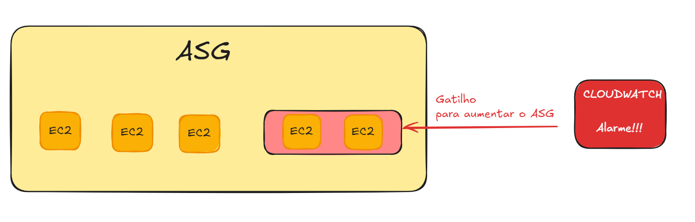

# Auto Scaling
Esse é o serviço que ajusta automaticamente a capacidade dos seus recursos de computação com base nas demandas da aplicação. Ele garante que você tenha o número correto de instância disponíveis para lidar com o tráfego, aumentando ou diminuindo o número de instâncias em resposta à carga de trabalho.

## Compontentes do AS

- **Groups (ASG)**
    - Componentes lógicos. Grupos de webservers, aplicações ou banco de dados.

- **Launch Templates**
    - Definem as configurações de inicialização usadas pelo ASG para lançar instâncias EC2. Esses templates permitem ajustar diversos detalhes da EC2, como:
        - AMI
        - Tipo de instância
        - Key Pairs
        - Security Groups
        - Rede e Subrede

- **Scaling Options**
    - Fornece diferentes estratégias para ajustar a capacidade dos ASGs. Isso pode ser feito com base em condições dinâmicas (Dynamic Scaling) ou através de agendamento.

## Tipos de Escalonamento
### Nível Fixo
- Mantém um número específico de instâncias rodando continuamente.

- Realiza verificações periódicas de saúde (**Health Checks**) nas instâncias.

- Se uma instância for detectada como **Unhealthy**, ela será substituída automaticamente por uma nova.

### Escalonamento Manual
- Permite ajustar manualmente o número mínimo, máximo ou desejado de instâncias no ASG

- Embora o escalonamento seja feito manualmente, o Auto Scaling gerencia a criação ou remoção das instâncias automaticamente com base nos parâmetros fornecidos.

## Políticas de Escalonamento Automático
### Scheduled Scalling
- Ocorre com base em horários e datas predefinidos.

- Ideal para situações onde você sabe com antecedência quando haverá picos ou quedas de demanda.
___
###  Dynamic Scaling
#### Target Tracking
- Define um alvo para o uso de recursos do ASG
- Simples de configurar
- Exemplo: "Uso médio da CPU deve ficar abaixo de 50%"

#### Simple / Step Scaling (Integração com CW)
- Quando um alarme do CW disparar (Exemplo: CPU > 70%), adicione mais 2 EC2s.
___
### Predictive Scaling
- Neste método, o ASG analisa dados históricos de carga para escalonar automaticamente baseado em horários e datas.

## Integração com Alarmes do CloudWatch
- É possível escalonar um ASG baseado nos alarmes do CloudWatch

- O Alarme é baseado em uma métrica, por exemplo: "Consumo médio da CPU do ASG está muito alto", daí aumentar número de instâncias.

- Dá pra integrar com outros serviços da AWS, tipo o SQS, utilizando a métrica "número máximo de mensagens na fila", por exemplo.

- Baseado no alarme, é possível aumentar (scale-out) ou diminuir(scale-in) o número de instâncias.

## ANOTAÇÕES
-  NÃO CONFUNDA AUTO-SCALLING GROUPS COM PLACEMENT GROUPS 
- Para corrigir algum erros em instâncias de um ASG, basta colocá-la em modo stand-by temporáriamente.