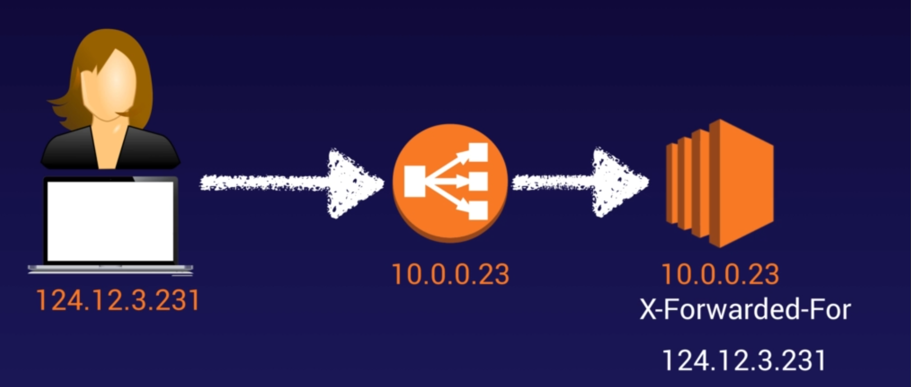
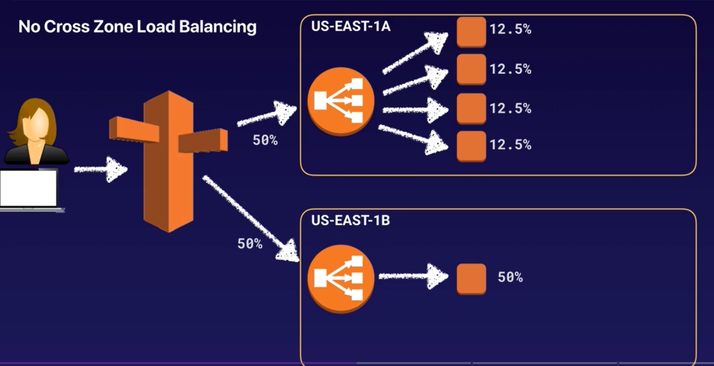
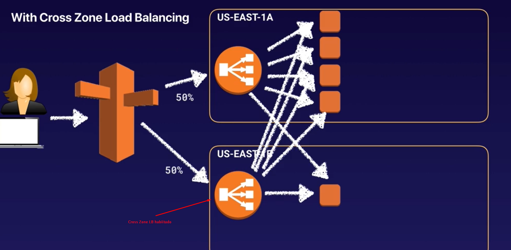
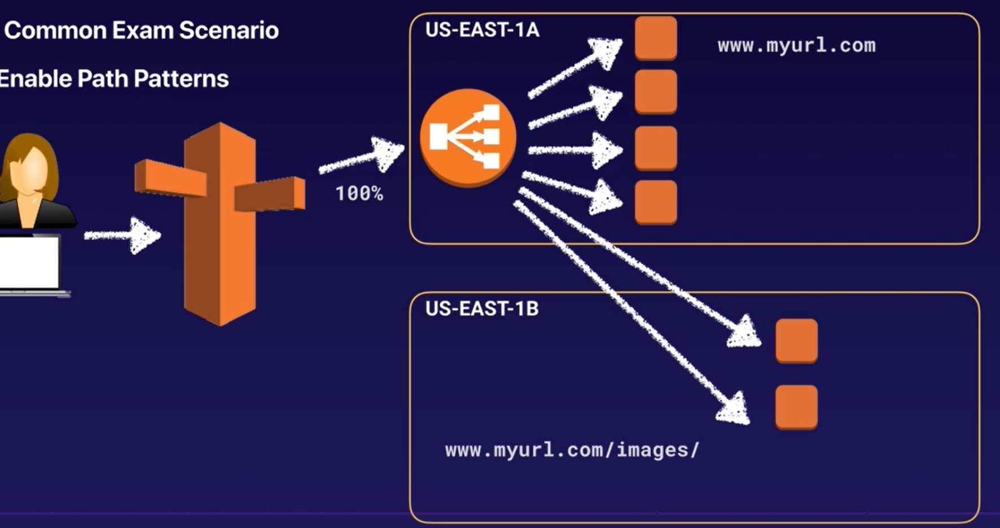

# Elastic Load Balancer (ELB)
## O que é?
O **Elastic Load Balancer** faz exatamente o que seu nome diz, ele equilibra a carga de trabalho entre múltiplos servidores, há 4 tipos de apicação para um LB, vejamos:

## Tipos 
### 1. Application LB (ALB)
- Ideal para tráfego HTTP/HTTPS, roteamento de aplicação pode ser baseado em:
    - Caminho da URL (exemplo.com **/users**)
    
    - Subdominio (**um**.exemplo.com & **dois**.exemplo.com)

    - Queries e Headers (exemplo.com/users?**id=123&nome=joao**)

	- Operam na primeira camada da pilha OSI, que é a camada da aplicação.
	
	- Formam uma boa combinação com microsserviços e aplicações baseadas em containers (Docker & ECS)
	
	- Possui a opção de mapear portas, que fará um redirecionamento dinâmico baseado na porta. (Bem útil para o ECS)

    #### Como o ALB toma decisões inteligentes?
    -  **Roteamento baseado em conteúdo**: O ALB permite que você direcione o tráfego para diferentes grupos de destino com base em regras específicas. Por exemplo, você pode rotear solicitações que contenham `/login` para um servidor específico e `/products` para outro.

    - **Suporte a microserviços e contêineres**: Ele é ideal para arquiteturas baseadas em microserviços, pois permite que diferentes partes de uma aplicação sejam gerenciadas e dimensionadas separadamente.

    - **Autenticação integrada**: O ALB pode integrar autenticação de usuários diretamente na camada de balanceamento, utilizando o Amazon Cognito para gerenciar identidades de usuários a sem necessidade de modificar a aplicação.

### 2. Network LB (NLB)
São otimizados para o balanceamento de carga do tráfego TCP, onde a extrema performance é desejada, operando na camada 4 (transporte de rede), NLBs são capazes de gerenciar milhões de requests por segundo, tudo isso mantendo uma latência ultra baixa.

### 3. Gateway LB (GWLB)
- Opera nas camadas 3 (rede) e 4 (transporte)

- Facilita  a implantação, escalabilidade e gerenciamento de dispositivos virtuais de rede, como firewalls e sistemas de inspeção de pacotes.

- Ideal na implementação de dispositivos de segurança como firewalls, sistemas de prevenção de intrusão (IPS), ou proxies.

- Na configuração de um GWLB, o tráfego para primeiro pela route table, e então a route table manda para o GWLB.

- **Utiliza o protocolo GENEVE**, na porta 6081.

## X-Forwarded-For
Este é um método de cabeçalho HTTP que identifica o real IP de origem do usuário que fez uma requisição para o ELB, uma vez que a requisição chega na instância como se fosse originada únicamente do ELB.

## Sticky Sessions

-  As sticky sessions permitem que você atrele a sessão/cookies de um usuário a uma instância EC2 específica. Isso garante que todas as requisições do usuário durante a sessão serão mandadas para a mesma instância.

- Os cookies de sessão podem ser configurados como:
    - **Duration-Based**: Gerenciados pelo próprio ELB, com duração pré-definida na configurações do ELB.
    
    - **Application-Based**: Gerenciados pela própria aplicação no back-end, é ela quem emite os cookies e o ELB os lê o valor para manter sua persistência, definindo assim o tráfego para a instância onde o cookie foi inicialmente criado.

- Você pode habilitar sticky sessions em ALBs também, porém o tráfico será mandado para um target group.

## Cross Zone Load Balancing
- A opção de Cross Zone permite que o roteamento seja manejado entre AZs. 
- Se essa opção estiver desabilitada, o ELB só poderá gerenciar a carga das instâncias dentro de sua própria AZ.
    
    ### Cross Zone Desabilitado
    

    ### Cross Zone Habilitado
    

## Path Patterns
Essa opção permite rotear requisições para determinadas regiões baseando no caminho da URL.  Só é possível utilizar essa estratégia em ALB

## Certificados SSL
- Um certificado SSL permite que o tráfego entre clientes e o LB seja criptografado em trânsito.

- Certificados SSL são gerados por Certificate Authorities(CA) como GoDaddy, LetsEncrypt, Symantec ETC.

    ### SNI (Serve Name Indication)
    - O SNI resolve o problema de abrigar múltiplos certificados SSL em um único servidor web (para múltiplos subdomínios).

    - Esse é um **protocolo mais moderno**, permite a identificação do certificado necessário logo no handshake inicial com o cliente.

    - SÓ PODE SER CONFIGURADO EM ALB, NLB e CLOUDFRONT.

## Deregistration Delay
- Essa é uma configuração que determina quanto tempo o LB vai esperar antes de desregistrar (remover) uma EC2 após ela ser marcada para remoção do balanceamento de carga.

- Com essa opção ativa, o LB NÃO vai interromper as conexões ativas com a EC2 sendo removida, mantendo-as até que os processos sejam concluídos ou até que o período de deregistration delay expire.

- As novas conexões não serão direcionadas para a EC2 que está desregistrando. Basicamente, Ninguém entra, mas quem tá dentro sai.

- **O valor padrão do atraso é 300 segundos (5 minutos), mas pode ser ajustado de 0 a 3600 segundos (1 hora).**

## Erros Comuns em LBs
- **CLB**: Se a sua aplicação parar de responder, um **CLB** responderá um erro 504. Isso significa que a aplicação está enfrentando problema, não o LB. A causa pode tanto estar na camada do servidor web quanto na camada da aplicação

### Preço
- O preço se baseia na quantidade de tempo que o LB fica rodando. O ALB por exemplo, custa $0,02 por hora.
## Anotações
- Instâncias monitoradas pelos ELBs são reportadas como **InService** ou **OutofService**

- LBs Utilizam security groups para controle de tráfego

- Todos os tipos de LBs possuem um IP privado, porém apenas o NLB possui um IP público estático, todos os outros são acessados via DNS.

- Leia o FAQ para detalhes específicos que aparecem no exame: https://aws.amazon.com/pt/elasticloadbalancing/faqs/