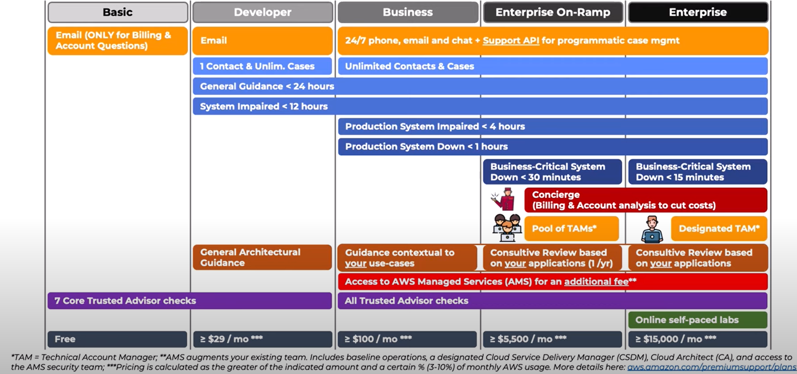

# Planos de Suporte

Há 5 tipos de planos de suporte na AWS:

## Basic
- **GRATUITO**
- Suporte via email (somente para dúvidas da conta e cobrança)
- Acesso limitado ao Trusted Advisor

## Developer
- **$29/Mês** OU 10% do seu gasto mensal com os serviços AWS, o qual for maior.
- Suporte total via email.
- 1 contato (endereço de email) para suporte.
- Tempo de resposta:
    - Dúvidas gerais => Até 24h
    - Sistema está infuncional => Até 12h
- Ajuda geral de arquitetura de sistema
- Acesso limitado ao Trusted Advisor

## Business
- **$100/Mês** OU 10% do seu gasto mensal com os serviços AWS, o qual for maior.

- Suporte 24/7 por telefone, email e chat. API do suporte para gerenciamento programático.

- Contatos ilimitados

- Tempo de resposta:
    - Dúvidas gerais => Até 24h
    - Sistema está infuncional => Até 12h
    - Sistema **de produção** está infuncional => Até 4h
    - Sistema **de produção** caiu => Até 1h

- Ajuda de arquitetura conextual (para o use case)

- Acesso ao <ins>AWS Managed Services¹</ins> por um custo adicional.

- Acesso ilimitado ao Trusted Advisor

## Enterprise On-Ramp
- **$5.500/Mês** OU 10% do seu gasto mensal com os serviços AWS, o qual for maior.

- Suporte 24/7 por telefone, email e chat. API do suporte para gerenciamento programático.

- Contatos ilimitados

- Tempo de resposta:
    - Dúvidas gerais => Até 24h
    - Sistema está infuncional => Até 12h
    - Sistema **de produção** está infuncional => Até 4h
    - Sistema **de produção** caiu => Até 1h
    - Sistema **crítico** caiu => Até 30min

- Inclui ajuda profissional para análise de gastos da conta para cortar custos.

- Acesso a um fórum de <ins>Technical Account Managers²</ins>.

- Direito a um review da arquitetura da _SUA_ aplicação **1 vez por ano**.

- Acesso ao <ins>AWS Managed Services¹</ins> por um custo adicional.

- Acesso ilimitado ao Trusted Advisor

## Enterprise
- **15.000/Mês** OU 10% do seu gasto mensal com os serviços AWS, o qual for maior.

- Suporte 24/7 por telefone, email e chat. API do suporte para gerenciamento programático.

- Contatos ilimitados

- Tempo de resposta:
    - Dúvidas gerais => Até 24h
    - Sistema está infuncional => Até 12h
    - Sistema **de produção** está infuncional => Até 4h
    - Sistema **de produção** caiu => Até 1h
    - Sistema **crítico** caiu => Até 15min

- Inclui ajuda profissional para análise de gastos da conta para cortar custos.

- Auxílio de um <ins>Technical Account Manager²</ins> individual.

- Direito a reviews ilimitados da arquitetura da _SUA_ aplicação.

- Acesso ao <ins>AWS Managed Services¹</ins> por um custo adicional.

- Acesso ilimitado ao Trusted Advisor

- Acesso ao labs para treinamentos e estudo da plataforma

# Anotações
1. AWS Managed Services é um serviço onde a infraestrutura da sua aplicação é 100% cuidada por especialistas da AWS, você só se preocupará com o código.

2. TAMs são profissionais especializados em suporte técnico aos serviços AWS.

# Imagem
