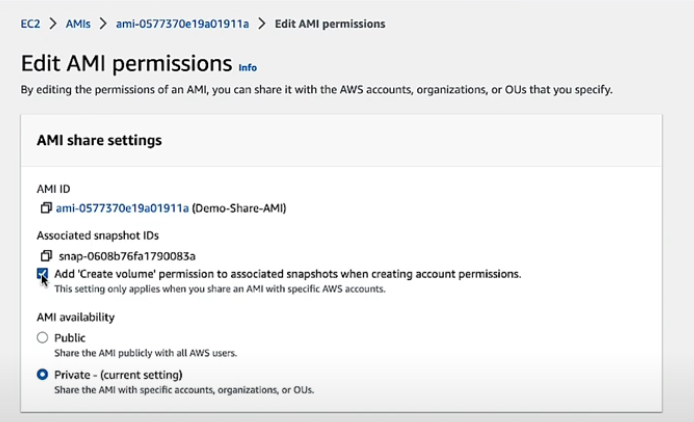

# AMI
Amazon Machine Image é o nome dado às imagens de instãncias EC2. São criadas a partir de um EBS.
==AMIs são únicas para cada região, portanto, uma imagem criada na região `us-east-1`(EUA) não funcionará na região `sa-east-1` (São paulo).==

# Anotações
- Ao fabricar sua própria imagem, você pode colocá-la a venda no AWS Marketplace
	- ==O valor das AMIs do AWS Marketplace são cobrados apenas uma vez== (não há modelo de assinatura).

- ==Apesar de uma imagem de uma região X não poder ser utilizada na região Y, é possível criar uma cópia da imagem da região X na região Y==.  O ID da AMI será diferente, no entanto.

- Podemos compartilhar AMIs com outras contas, veja alguns detalhes:
	- As policies de identitidade do usuário da outra conta devem permitir o uso de uma AMI.
	
	- ==**As AMIs não possuem RBP (resource-based policies)**==. Para garantir o acesso de outras contas a sua AMI, ==você deve especificar manualmente== quais contas podem executar instâncias a partir da AMI e quais podem copiar a AMI para a conta deles **via console ou CLI**.

	- **Você não precisa compartilhar o snapshot EBS associado à AMI, apenas a AMI já basta.**
	