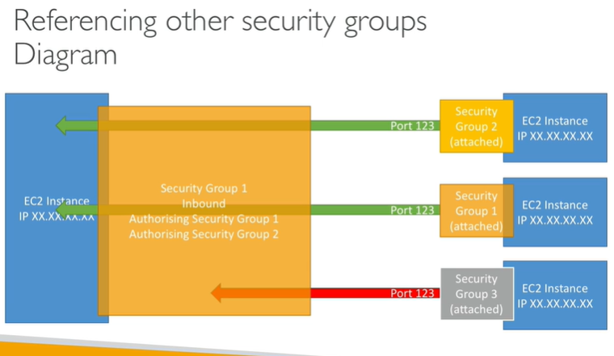
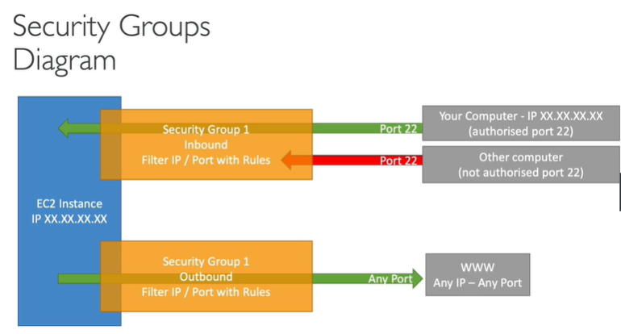
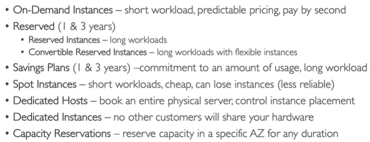
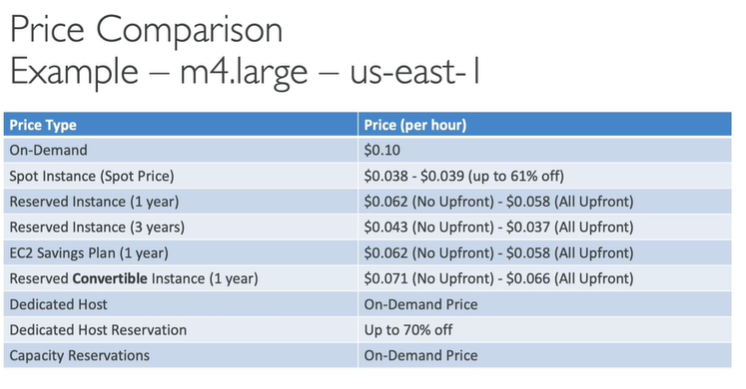

# EC2

## **Os Tipos**

- **General Purpose**:
    - Equilíbrio entre processamento, memória e rede.
    - Ideal na maioria dos casos.

- **Compute Optimized**:
    - Instância que possui foco no poder de processamento (CPU).
    - **Use case**: Computação de alta performance (HPC), processamento em lote, decodificação de vídeos, jogos etc.
    

- **Memory Optimized**:
    - São projetadas para fornecer performance rápida para workloads que processam grandes conjuntos de dados na memória RAM.
    - **Use case**: Workloads que consomem muita memória, como bancos de dados de código aberto, caches na memória e análise de big data em tempo real.
    

- **Storage Optimized**:
    - Ótimas para tarefas que exigem alta capacidade de armazenamento, isto é, acesso a leitura e escrita de uma grande quantidade de dados no disco local.
    - **Use case**: Aplicações intensivas de E/S, bancos de dados transacionais, Amazon OpenSearch, Aplicações de Data warehouse e análises em tempo real.
    

## **Grupos de Segurança**

- Os **Security Groups** são o ponto chave da segurança de rede na AWS.

- Eles controlam como o tráfego de E/S é permitido ou negado para a EC2.

- Security Groups possuem somente regras de allow.

- As regras dos **Security Groups** podem referenciar um IP ou então outro Security Group **(SGs podem referenciar uns aos outros).**

No esquema de referência a outro grupo de segurança, indica que o tráfego está liberado para qualquer instância que faça parte daquele grupo referenciado, independente do IP, bom demais.

Basicamente, Grupos de Segurança agem como firewalls para instâncias EC2.

Eles regulam:

- Acesso a portas;
- Faixas de IP liberadas (IPv4 e IPv6);
- Controle de conexões **inbound** (de um dispositivo externo para a instância);
- Controle de conexões **outbound** (Da instância para dispositivo externo);

## **Opções de Cobrança**
- **On-Demand**: Método mais comum, pague pelo que você utilizar.

- **Saving Plans**: Preços mais baratos, em troca de um contrato que forçará um tempo mínimo de uso dos recursos, de 1 ou 3 anos. _Tudo cobrado em doláres por hora._

- **Reserved Instances**: Preços ainda mais baratos, aqui você escolhe todos os recursos da instância e então assina um contato de uso para 1 ou 3 anos, são três opções de pagamento:
    - All Upfront
    - Partial Upfront
    - Nothing Upfront

- **Spot Instances**: A opção mais barata da AWS, funciona como um leilão de instâncias, você coloca seu valor em uma pool de instâncias e então utiliza ela enquanto o seu lance for maior que os existentes no mercado, mas muito cuidado, se aparecer um lance maior que o seu, você perde a instância, tolerância de 2 minutinhos pra vazar da instância

- **Dedicated Hosts**: Um servidor físico no data center da AWS dedicado a você, ideal para casos de BYOL e compliance. Pode ser até 70% mais barato que o modelo On-Demand.

## **Interfaces de Rede**

### **ENI (Elastic Network Interface) - Padrão - $**
- **Definição:** Uma ENI é uma interface de rede virtual que pode ser anexada a uma instância EC2. Ela funciona como uma interface de rede física, contendo um endereço IP primário, um ou mais endereços IP secundários, um ou mais grupos de segurança, um endereço MAC, e outras configurações de rede.

- **Uso:** ENIs são usadas para conectar instâncias EC2 a sub-redes em uma VPC. Elas permitem que você mova interfaces entre instâncias, o que pode ser útil para cenários de alta disponibilidade ou para isolar diferentes tipos de tráfego.

- **Exemplo de Aplicação:** Ter múltiplas interfaces de rede em uma instância para segmentar o tráfego de rede ou para separar diferentes camadas de aplicação.

### **ENA (Elastic Network Adapter) - Alta Performance - $$**
- **Definição:** O ENA é um adaptador de rede de alta performance projetado para oferecer suporte a _Enhanced Networking_ na AWS. Oferece maior largura de banda, menor latência e menor sobrecarga em comparação com as interfaces de rede padrão.

- **Uso:** ENA é usado principalmente em instâncias EC2 que exigem alta performance de rede, como em aplicações de HPC (High-Performance Computing) e grandes clusters de dados.

- **Exemplo de Aplicação:** Quando uma instância EC2 precisa de uma largura de banda de rede de até 100 Gbps, como em simulações científicas ou análises de Big Data.

### **EFA (Elastic Fabric Adapter) - Potência Máxima - $$$**

- **Definição:** O EFA é um adaptador de rede que fornece latência ultrabaixa e alta taxa de transferência, além de suporte para aplicativos de HPC que usam bibliotecas de comunicação de rede como MPI (Message Passing Interface). **O EFA não é compatível com as instâncias do Windows.**

- **Uso:** EFA é especificamente projetado para workloads HPC que requerem uma comunicação de rede extremamente rápida e eficiente, como em simulações científicas, bolsa de valores ou sistemas críticos.

- **Exemplo de Aplicação:** Aplicações HPC distribuídas que exigem uma comunicação rápida entre instâncias EC2 em um cluster, como no uso industrial ou renderização gráfica em 3D.

## **Placement Groups**
É um recurso do Amazon EC2 que permite controlar o posicionamento de instâncias em hardware subjacente dentro de uma AZ. Eles são usados para melhorar o desempenho da rede ou a resiliência das instâncias.

### Tipos de Placement Groups:
1. **Cluster**:
    - **Objetivo:** Maximizar o desempenho da rede ao agrupar instâncias próximas umas das outras no mesmo rack ou em racks adjacentes.
    
    - **Uso Ideal:** Workloads que exigem baixa latência e alta taxa de transferência entre instâncias, como HPC (computação de alto desempenho) e grandes bancos de dados distribuídos.
    
    - **Limitação:** Alta disponibilidade pode ser comprometida, pois as instâncias estão fisicamente próximas e podem ser afetadas por falhas no rack.

2. **Spread:** 
    - **Objetivo:** Garantir que as instâncias sejam distribuídas por diferentes racks, reduzindo o risco de falhas correlacionadas.
    
    - **Uso Ideal:** Aplicações críticas que precisam de alta disponibilidade e resiliência, onde as instâncias precisam estar distribuídas.

    - **Limitação:** Número máximo de instâncias por grupo espalhado é limitado (normalmente até 7 instâncias por grupo em algumas regiões).

3. **Partition**:
    - **Objetivo:** Distribuir instâncias em partições lógicas, onde cada partição tem seus próprios racks. Isso fornece isolamento entre grupos de instâncias dentro de uma partição. Partições podem estar em múltiplas AZ.
    
    - **Uso Ideal:** Grandes sistemas distribuídos, como Hadoop, HDFS, e Cassandra, onde a falha de uma partição não deve afetar as outras.
    
    - **Limitação:** Menor densidade de instâncias por partição comparado ao Cluster Placement Group.
    - A diferença entre Partition e Spread é que uma partição que fica em um rack pode incluir várias instancias, veja a imagem de exemplo onde temos 3 partições, cada uma em sua própria rack, e em cada partição temos 3 instâncias:

### Cenários de Uso
- **Cluster Placement Group:** Quando você precisa de baixa latência de rede, como em simulações científicas, machine learning, ou grandes bancos de dados.
- **Spread Placement Group:** Quando a prioridade é a resiliência, como em sistemas críticos que não podem ter todas as instâncias afetadas por uma única falha de hardware.
- **Partition Placement Group:** Para grandes sistemas distribuídos que requerem isolamento de falhas entre diferentes grupos de dados ou componentes do sistema.

### Resumo
- **Cluster Placement Groups** são usados para otimizar o desempenho da rede.
- **Spread Placement Groups** garantem a alta disponibilidade distribuindo instâncias em racks diferentes.
- **Partition Placement Groups** oferecem uma abordagem híbrida que isola falhas entre partições.

## EC2 Hibernate
- O modo hibernate permite que você deixe a instância em uma espécie de "modo descanso", fazendo com que o **estado da memória RAM** seja preservado no EBS correspondente da instância. É bem interessante quando se trata de poupar gastos sem perder o estado da máquina. Veja alguns detalhes:
    - A RAM da máquina deve ter: 
        - **Menos de 150GB em SOs Linux**
        - **Menos de 16GB em SOs Windows**
    -  O volume root deve estar no EBS e ser criptografado, **NADA DE INSTANCE STORE.** O EBS deve possuir tamanho proporcional à memoria RAM.
    - Disponível em todos os tipos de aquisição de instância (**On-Demand, Reserved e Spot**)
    - Uma instância não pode hibernar por mais de **60 dias**.

## Outros Detalhes
- SGs são fixos a uma região e uma VPC
- O usuário da EC2 não visualiza as regras de tráfego aplicadas a máquina dele
- É uma boa prática manter um SG exclusivo para acesso SSH.
- **Troubleshooting**:
    - Se a sua aplicação não está acessível (timeout), é problema no SG.
    - Agora, se a aplicação devolve um erro “conection refused”, então é um erro da aplicação, ou então ela não está rodando mesmo, pois o trafégo está ok.
- Por padrão:
    - **Todo tráfico inbound é bloqueado.**
    - **Todo tráfico outbound está autorizado.**
- Porta para lembrar: 
    - 3389 ⇒ RDP (Remote Desktop Protocol) - Logar em uma instância Windows.
- Por padrão, Scripts do User Data rodam com privilégio de root.
- É possível migrar uma instância de um placement group para outro, mas não é possível fundir dois placement groups em um só.
