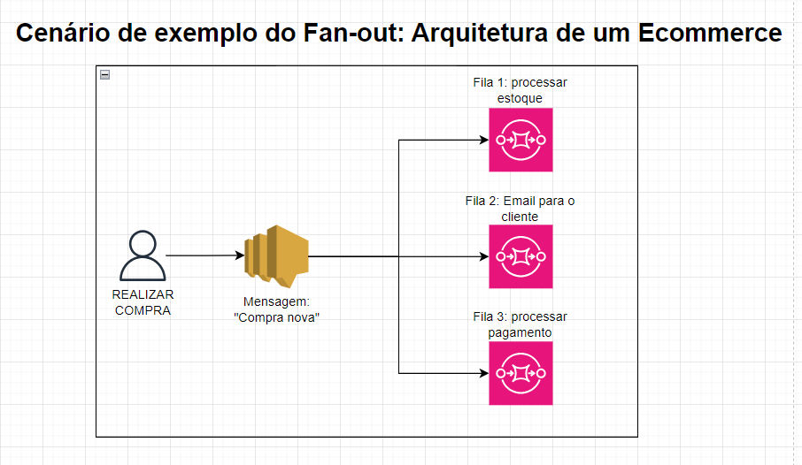

# SQS
É um serviço de mensageria totalmente gerenciado que permite o envio, armazenamento e recebimento de mensagens entre componentes de uma aplicação distribuída sem a necessidade de gerenciar servidores ou infraestrutura.

## Filas de Mensagens
O SQS oferece dois tipos de filas:
- **Standard Queue**: Garante entrega de mensagens pelo menos uma vez, mas não mantém a ordem das mensagens. Ideal para sistemas distribuídos que podem lidar com uma possível duplicidade de mensagens. QUANTIDADE DE TRANSAÇÕES É ILIMITADA

- **FIFO Queue (First In, First Out)**: Garante a entrega de mensagens exatamente uma vez e preserva a ordem de envio. Ideal para casos onde a ordem de processamento das mensagens é crítica, como em transações financeiras. LIMITADA A 300 TRANSAÇÕES POR SEGUNDO.

## Vantagens do SQS
- **Desacoplamento de Sistemas**: O SQS permite que componentes de uma aplicação se comuniquem sem depender uns dos outros diretamente.  Um sistema pode enviar uma mensagem para a fila e continuar seu processamento, enquanto outro sistema pode processar essa mensagem posteriormente, garantindo escalabilidade e tolerância a falhas.

- **Escalabilidade Automática**: O SQS se ajusta automaticamente conforme a demanda aumenta ou diminui, sem necessidade de provisionamento manual de recursos, lidando de maneira eficiente com grandes volumes de mensagens.

- **Mensagens Temporárias**: As mensagens podem ser armazenadas em uma fila por um tempo definido (até 14 dias), dando aos componentes tempo para processá-las. **Se a mensagem não for processada dentro do período, ela expira.**

- **Configuração de Retries (Dead Letter Queues)**: Você pode configurar filas de dead-letter para capturar mensagens que falharam no processamento após várias tentativas, facilitando o diagnóstico e correção de problemas sem perda de mensagens.

## Visibilidade de Mensagem - Message Visibility Timeout
- Quando uma mensagem é recuperada por um consumidor, ela ficará invisível para outros consumidores.

- **Por padrão, este tempo é de 30 segundos.** (Isso significa que a mensagem tem 30 segundos para ser processada)

- Depois desse timeout acabar, a mensagem ficará visível novamente para outros consumidores (inclusive para o consumidor que não processou a mensagem a tempo)

- É possível fazer com que o consumidor chame a API **ChangeMessageVisibility** para pedir mais tempo até dar timeout.

- **CUIDADO**: Tempo de mais pode deixar uma mensagem presa com um consumidor que está crashado, tempo de menos pode fazer com que nenhum consumidor processe a mensagem a tempo.

## Fan-out
O fan-out é o nome dado a um processo que ocorre na integração entre SNS e SQS.
==Se trata do envio de uma única mensagem/evento para várias filas SQS==, essa estratégia deve ser aplicadas em contextos onde temos uma arquitetura desacoplada com múltiplos processos que ocorrem ao disparar de um mesmo evento. Em uma aplicação de ecommerce, por exemplo, deveríamos colocar 3 filas diferentes para uma mensagem de "Usuário realizou uma nova compra".

> **Observação**: Para que este serviço funcione corretamente, é necessário que a fila SQS tenha uma política que permita o SNS realizar publicações nela.

## Long Pooling
- Quando um consumidor faz uma requisição por uma mensagem em uma fila que está vazia, ele pode opcionalmente "esperar" até que uma mensagem chegue. O nome disso é Long pooling.

- O Long Pooling pode fazer com que a quantidade de chamadas de API feitas para o SQS reduza, ao mesmo tempo que a eficiência da aplicação é mantida.

- **É possível definir de 1 a 20 segundos.**

- Long pooling é sempre mais preferível do que short pooling.
## Anotações
- No exame, sempre que cair uma questão relacionado ao desacoplamentos (decouple) de aplicações, lembre do SQS, pois eles usam exatamente essa terminologia.

- As mensagens podem pesar até 256KB de texto em qualquer formato

- O nome de uma fila FIFO necessariamente deve terminar com ".fifo"

- O S3 é utilizado como ponto de armazenamento das mensagens.

- O SQS é **pull-based**, e não push-based. (É obrigatório ter um puller definido, que na maioria dos casos, é uma instância.)