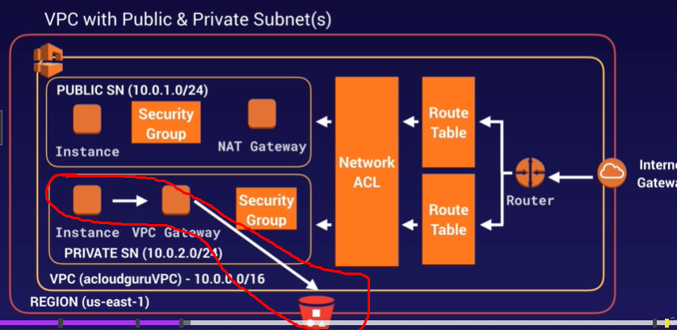

## VPC Endpoints
Permitem que você conecte sua VPC a serviços da AWS de forma privada, sem a necessidade de usar a internet, gateways, NAT ou VPNS. Eles proporcionam uma maneira segura e eficiente de acessar serviços AWS diretamente da sua VPC, mantendo o tráfego dentro da rede da AWS.

Além da velocidade, os VPC Endpoints também podem ajudar a reduzir os custos, uma vez que o tráfego será mantido dentro da rede AWS e nunca sairá para a internet.

### Tipos de VPC Endpoint:
- **Interface Endpoints**
    - Utiliza uma Elastic Network Interface (ENI) com endereço IP privado dentro da VPC. Esse endpoint é conectado aos serviços AWS, com serviços que suportam a interface VPC.
    
    - Possui suporte para a maioria dos serviços da AWS.
    
	- Custo por hora e por quantidade de dados processados (**CARO**).
	
	- **O tráfego nunca sai da rede privada da AWS**.

- **Gateway Endpoints**
    
    - É um gateway que é adicionado à sua tabela de rotas para direcionar o tráfego destinado a serviços específicos, como o S3 e Dynamo DB, tudo isso internamente pela infraestrutura da AWS.
    
	- O uso é específico para serviços como S3 e o Dynamo DB, que suportam esse tipo de endpoint, permitindo acesso privado sem a necessidade de uma conexão pública.
    
	- Possui suporte para S3 e DynamoDB.
    
	- Fácil de configurar e cost-free, sempre que possível prefira usar um gateway endpoint do que uma Interface Endpoint.

Em suma, a única diferença entre os dois tipos é a forma de implementação