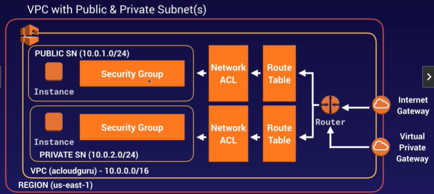
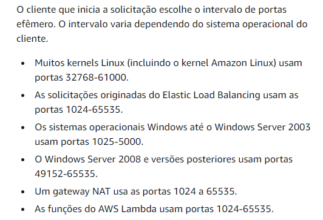
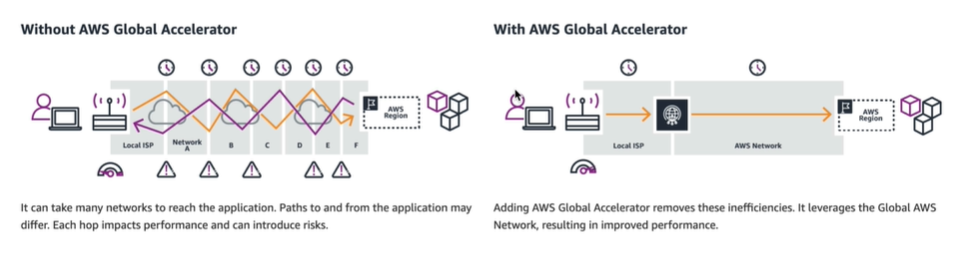
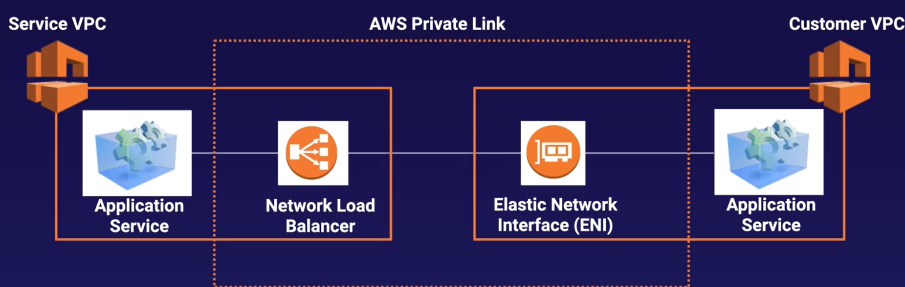
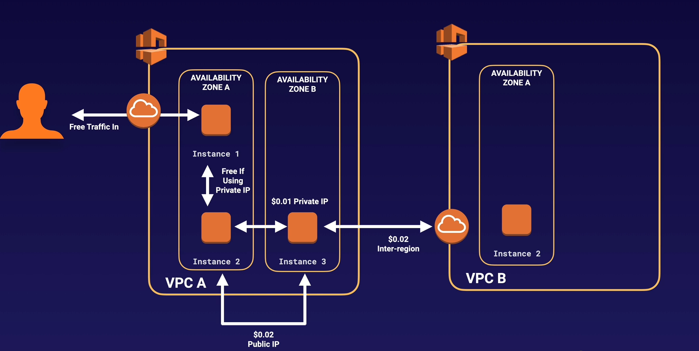

# VPC

## O que é?
O **Virtual Private Cloud** é o serviço de rede privada virtual da AWS. Ele permite ter controle total da infraestrutura de rede em nuvem,
nele se tem controle total do ambiente virtual, incluindo selecção da sua própria faixa de IP, criação de subredes e configuração da tabela de roteamento e gateways de rede.

Isto permite que você provisione uma seção lógicamente isolada da nuvem AWS, onde é possível utilizar recursos utilizando desta rede.

    Podemos, por exemplo, criar uma sub-rede de acesso público para o frontend da aplicação e outra sub-rede privada para o backend.

É possível definir várias camadas de segurança, incluindo security groups e ACLs, o que ajuda muito no controle de acesso à instância em cada subrede.

    Além de tudo, também é possível criar uma extensão da sua rede local através de uma VPN site-to-site ou pelo AWS Direct Connect.

## Detalhes
### VPC Padrão vs VPC Customizada
- VPCs padrão são user-friendly, permitindo dar um deploy imediato.

- Todas as subredes na VPC padrão possuem saída para a internet habilitada.

### VPC Peering
- Permite que você conecte uma VPC a outra através de um roteamento direto utilizando os IPs privados.
- Instâncias se comportam como se estivessem na mesma rede privada.
- Você pode emparelhar VPCs com outra conta AWS, assim como também pode fazer isso com outras VPCs da sua conta.

- 
    É possível emparelhar VPCs em regiões diferentes.
 

- O emparelhamento é bidirecional, 1x1 para cada peering. Exemplo, se tivermos 3 VPCs: A, B e C. Precisaremos de 3 pareamentos individuais.

- Também é muito importante adequar todas as route-tables para que todas as intâncias nas 3 redes comuniquem umas com as outras.

## Reserva de IPs
- Ao criar uma subrede, você irá notar que 5 IPs já estarão reservados, exemplificando em uma rede 10.0.0.0/24 a reserva é feita desta forma:
    - 10.0.0.0 => Endereço da rede;
    - 10.0.0.1 => Reservado para o roteador VPC;
    - 10.0.0.2 => Reservado para o servidor DNS (sempre é o range da rede + 2);
    - 10.0.0.3 => Reservado para uso futuro (serviços que poderão ser usados no futuro);
    - 10.0.0.255 => Reservado para o broadcast.

## Criação de Subredes
- Quando você criar uma VPC, também será criado uma Route Table, uma Network Access Control List (NACL) e um Security Group, todos com permissões padrão. Resumidamente, as permissões são:
    - **Route Table**: Inicialmente sem acesso à internet.
    - **NACL**: Permite todo o tráfego Inbound e Outbound.
    - **Security Group**: Bloqueia todo o tráfego Inbound (exceto entre instâncias no mesmo grupo) e permite todo o tráfego Outbound.

- ATENÇÃO: Por padrão, o auto-assign de IP público fica desativado ao criar uma nova subrede. 

## Diferença entre Route Table, NACL e Security Group
### **1. Route Table**
- **Função**: Determinar como o tráfego é roteado dentro da VPC. Ela define o encaminhamento com base no endereço de destino da solicitação, permitindo direcionar o tráfeco para gateways, subredes e outras VPCs.
- **Use Case:** Controlar a comunicação entre subredes e definir rotas de saída para internet ou outras redes privadas.

### 2. Network ACL
- **Função:** Listas de controle que operam NO NÍVEL DA SUBREDE.
 - São **stateless**, portanto você deve configurar as regras de entrada e de saída separadamente.

- **Use Case:** Implementada para aplicar regras de segurança adicionais **NAS SUBREDES**, como em um ambiente onde você precisa bloquear todo o tráfego de entrada de um intervalo de IP específico, mas permitir o tráfego de saída.

### 3. Security Group
- **Função:** São firewalls no NÍVEL DA INSTÂNCIA, controlando o tráfego de entrada e saída para instâncias EC2 específicas. Eles são **stateful**, o que significa que uma regra de entrada ou saída automaticamente permite o tráfego de retorno correspondente.

- **Use Case:** Usados para proteger instâncias específicas, como em um cenário onde você deseja permitir o tráfego SSH (porta 22) de um determinado IP externo, mas bloquear todo o tráfego de entrada de outras portas.

## VPC Flow Logs
- Essa é uma ferramenta que permite capturar informações do tráfico IP de entrada e saída da sua VPC. 

- Os dados do Flow log **são armazenados no CloudWatch Logs ou, opcionalmente, em um Bucket S3**. 

- Após ter criado um flow log, você poderá analisá-lo em detalhes nos logs da CloudWatch.

- Os Flow logs podem ser criados em três níveis:
    - VPC
    - Subrede
    - Interface de Rede da instância

- NÃO é possível definir um flow log de uma VPC emparelhada cross-account.

## Bastion Host
Um Bastion Host é um servidor que atua como um ponto de acesso seguro para acessar instâncias que ficam em subredes privadas da VPC, o Bastion é o único a estar localizado na rede pública e ser exposto à internet. Administradores acessam o Bastion Host via SSH ou RDP e, a partir dele, conectam-se às instâncias privadas, que não tem acesso à internet.

### Observações:
- Um NAT Gateway ou NAT instance é usada para providenciar tráfego da internet para instâncias em subredes privadas.
- NÃO É POSSÍVEL UTILIZAR UM NAT GATEWAY COMO BASTION.

## Network Address Translation (NAT)
O NAT é uma técnica usada para traduzir endereços IP privados de uma rede interna para endereços IP públicos (ou outros endereços IPs) para tráfego de saída ou de entrada. No contexto da AWS, o NAT é usado para permitir que instâncias em subredes privadas da VPC possam acessar a internet ou outros serviços externos, sem que seu IP privado seja exposto.

### NAT Gateway
- Serviço gerenciado que permite que instâncias em subredes privadas enviem tráfego de saída para a internet, enquanto impede conexões de entrada iniciadas da internet.
- São altamente disponíveis e escalam automaticamente para lidar com grandes volumes de tráfego. (vão de 5Gbps até 45Gbps) 
- O uso de um NAT Gateway gera custos com base no tempo de execução (por hora) e na quantidade de dados processados.
- Não é associado a nenhum security group.
- Recebe um endereço de IP público automaticamente.

### NAT Instance
- É possível usar uma instância EC2 configurada com um software NAT para servir a mesma função que o NAT Gateway.

- A vantagem é o controle total sobre a configuração, mas isso requer gerenciamento manual, incluindo ajustes para alta disponibilidade e escalabilidade

- É uma opção de custo menor que o NAT gateway, mas **só é ideal para pequenas cargas, pois uma maior carga de trabalho exigirá mais poder de processamento da instância NAT,** além do fato de que o trabalho de configuração será 100% manual.

- Há um recurso nas instância EC2 chamado **Source/Destination**, que faz com que a instância "cheque" se ela é a origem ou o destino de qualquer tráfego enviado ou recebido na rede. No caso das NAT Instances, esse recurso **PRECISA ESTAR DESABILITADO**, uma vez que essa instância deverá lidar com tráfego onde ela não é a origem e nem o destino. 

## Network ACL
- Regras do NACL são obedecidas em ordem cronológica (Portanto se eu tenho uma regra de aceitar tudo na ordem 100, e uma regra de DENY para o IP x.x.x.x na ordem 200, o IP x.x.x.x não será banido, pois a regra 100 triunfou sobre a regra 200).

- É muito importante liberar o acesso inbound/outbound das portas efêmeras, o range das portas efêmeras variam de acordo com o cliente que você está se comunicando. Mas no geral são as portas 1024-65535, portanto libere estas. Veja a documentação:

- Ao criar um novo NACL, todo o tráfego estará com regra de DENY por padrão.

- Um NACL pode estar associado a múltiplas subredes, no entanto uma subrede só pode esta associado a um único NACL.

## Internet Gateway e Virtual Private Gateway
- O IGW é utilizado para conceder acesso a internet para uma VPC, é anexo diretamente ao Route Table.

- O VPG também permite o tráfego de hosts de redes externas, no entanto, somente os que forem especificados. Ou seja, não é toda a internet que terá acesso aos dispositivos e recursos dentro da sua VPC.
	- A VPG é ideal para criar uma conexão VPN entre você e uma outra rede sua.

## AWS Direct Connect
Este é um serviço que estabelece uma conexão dedicada entre sua infraestrutura local e a AWS. Diferente de uma conexão padrão à internet, o Direct Connect proporciona uma conexão com alta largura de banda, baixa latência, e com mais consistência, uma vez que **não depende da internet pública**.

- Útil para uma carga pesada de throughput.
- Oferece uma conexão estável e segura, uma vez que não utiliza a internet pública para transferência de dados entre sua rede e a AWS.

### Passos para configurar um Direct Connect
- **1.** Crie uma interface virtual na seção Direct Connect do Console. (**PUBLIC VIRTUAL INTERFACE**)
- **2.** Vá para a seção de VPC > VPN, e então crie um Customer Gateway.
- **3.** Crie uma Vpg (Virtual Private Gateway)
- **4.** Acople a VPG na VPC desejada
- **5.** Vá no painel de "Conexões VPN" e crie uma nova conexão VPN.
- **6.** Selecione a VPG e o customer gateway nas opções da VPN.
- **7.** Assim que a VPN estiver disponível, vá até o customer gateway nopainel do direct connect e configure a VPN.

## Global Accelerator
O Global Accelerator é um serviço de rede que melhora a disponibilidade e a performance das suas aplicações. Com ele, o tráfego dos usuários é roteado para a poderosa rede backbone da Amazon, e apartir dela, segue para várias regiões da AWS, escolhendo automaticamente a melhor rota para minimizar a latência.

- Ideal para aplicações que atendem usuários distribuídos globalmente, como sites, APIs, e serviços em tempo real.

- Por padrão, o GA providencia dois IPs estáticos que estarão associados ao seu accelerator.

- É possível diminuir ou aumentar a porcentagem do tráfego para um determinado endpoint group ajustando o traffic dial nas configurações.

## VPC Private Link
Tecnologia que permite o acesso de forma segura os serviços  hospedados em outras VPCs de maneira privada, sem que o tráfego precise passar pela internet pública.

- Não é necessário fazer VPC peering

- Requer um NLB (Network Load Balancer) na VPC servidora e uma ENI na VPC cliente.

- Se no exame cair alguma questão relacionada a emparelhar a VPC a dezenas, centenas ou milhares de clientes, pense no AWS Private Link.

## Transit Gateway
Serviço que permite conectar múltiplas VPCs, contas da AWS e redes on-prime através de um único gateway centralizado. Ele simplifica a interconexão de redes em grande escala, permitindo que você crie uma malha de rede altamente escalável e grenciável.

-   A principal ideia por trás deste serviço é unir todas as redes conectadas em um único hub central, simplificando a topologia. 

- Suporta milhares de conexões, facilitando a expansão de rede à medida que novas VPCs ou redes precisam ser integradas.

- A base fica em uma única região, porém é possível acoplar redes que estão em outras regiões.

- É possível utilizar a route tables para gerenciar como uma VPC comunica com a outra.

## Custos de Rede

Lembre-se:
- Tráfego Inbound da internet é gratuito
- **Para poupar gastos, sempre que possível utilize endereços IP privados ao invés de IPs públicos**.
- Se quiser zerar os custos de rede, basta agrupar todas as instâncias na mesma AZ e usar somente um IP privado, Isso é livre de custos, mas não se esqueça que isso diminui ao grau de disponibilidade e redundância. 

## Limites
- Até 200 sub redes por VPC (esse número pode reduzir dependendo da alocação dos CIDR blocks definido pelo usuário).

- Até 200 route tables por VPC 

- Até 200 NACLs por VPC, cada NACL pode ter até 20 regras

- UMA única internet gateway por VPC. (Não faz sentido ter duas saídas para internet, né?)

-  É possível ter até 5 VPCs por região, para aumentar esse limite é necessário contatar o suporte da AWS.

## Anotações

- O tamanho máximo de uma VPC é /16 (16 bits reservados para rede), que permite 65.536 dispositivos.
- Você só pode ter uma IGW (Internet Gateway) por VPC.

-  As AZs são ordenadas aleatoriamente para cada conta da AWS, por exemplo: O SP-EAST-1A da minha conta não é o mesmo que o SP-EAST-1A na sua conta, até porque se não fosse aleatório todo mundo sempre iria escolher as AZs A e B.

- Nenhuma subrede é criada automaticamente.

- **Só há um caso onde interface endpoint é preferível do que gateway endpoint: Quando você pretende conectar uma máquina on-premise com a VPC. (Site-to-Site VPN)**

- O bloqueio de IPs deve ser feito pelo NACL, e não pelos Security Groups.

- É possível fazer com que uma NAT Instance tenha HA, no entanto isso exigirá um Autoscaling Group, subredes em diferentes AZs e um script que automatize o failover.