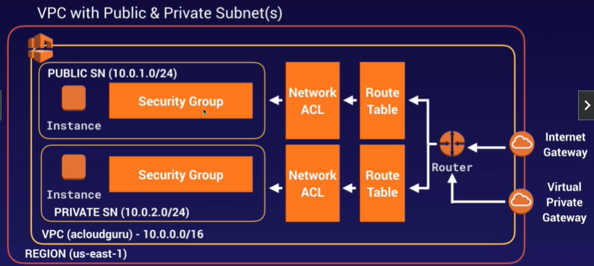
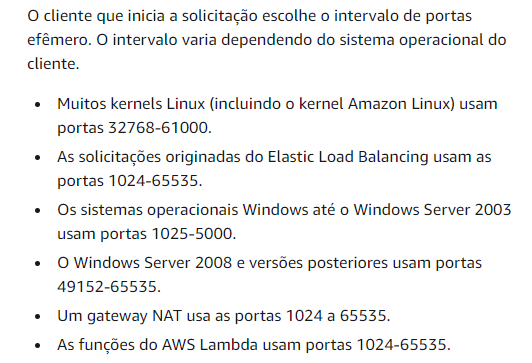

# VPC

## O que é?
O **Virtual Private Cloud** é o serviço de rede privada virtual da AWS. Ele permite ter controle total da infraestrutura de rede em nuvem,
nele se tem controle total do ambiente virtual, incluindo selecção da sua própria faixa de IP, criação de subredes e configuração da tabela de roteamento e gateways de rede.

Isto permite que você provisione uma seção lógicamente isolada da nuvem AWS, onde é possível utilizar recursos utilizando desta rede.

    Podemos, por exemplo, criar uma sub-rede de acesso público para o frontend da aplicação e outra sub-rede privada para o backend.

É possível definir várias camadas de segurança, incluindo security groups e ACLs, o que ajuda muito no controle de acesso à instância em cada subrede.

    Além de tudo, também é possível criar uma extensão da sua rede local através de uma VPN site-to-site ou pelo AWS Direct Connect.

## Detalhes
### VPC Padrão vs VPC Customizada
- VPCs padrão são user-friendly, permitindo dar um deploy imediato.

- Todas as subredes na VPC padrão possuem saída para a internet habilitada.

### VPC Peering
- Permite que você conecte uma VPC a outra através de um roteamento direto utilizando os IPs privados.
- Instâncias se comportam como se estivessem na mesma rede privada.
- Você pode emparelhar VPCs com outra conta AWS, assim como também pode fazer isso com outras VPCs da sua conta.

- 
    É possível emparelhar VPCs em regiões diferentes.
 
- O emparelhamento é em estrela, isto é, 1 VPC central pareando com outras 4. Sem emparelhamento transitivo.

## Reserva de IPs
- Ao criar uma subrede, você irá notar que 5 IPs já estarão reservados, exemplificando em uma rede 10.0.0.0/24 a reserva é feita desta forma:
    - 10.0.0.0 => Endereço da rede;
    - 10.0.0.1 => Reservado para o roteador VPC;
    - 10.0.0.2 => Reservado para o servidor DNS (sempre é o range da rede + 2);
    - 10.0.0.3 => Reservado para uso futuro (serviços que poderão ser usados no futuro);
    - 10.0.0.255 => Reservado para o broadcast.

## Criação de Subredes
- Quando você criar uma VPC, também será criado uma Route Table, uma Network Access Control List (NACL) e um Security Group, todos com permissões padrão. Resumidamente, as permissões são:
    - **Route Table**: Inicialmente sem acesso à internet.
    - **NACL**: Permite todo o tráfego Inbound e Outbound.
    - **Security Group**: Bloqueia todo o tráfego Inbound (exceto entre instâncias no mesmo grupo) e permite todo o tráfego Outbound.

## Diferença entre Route Table, NACL e Security Group
### **Route Table** 👑
- Função: Determinar como o tráfego é roteado dentro da VPC. Ela define o encaminhamento com base no endereço de destino da solicitação, permitindo direcionar o tráfeco para gateways, subredes e outras VPCs.
- Use Case: Controlar a comunicação entre subredes e definir rotas de saída para internet ou outras redes privadas.

### Network ACL 👮
- Função: Listas de controle que operam 
NO NÍVEL DA SUBREDE.
 São stateless, portanto você deve configurar as regras de entrada e de saída separadamente.

- Use Case: Implementada para aplicar regras de segurança adicionais **NAS SUBREDES**, como em um ambiente onde você precisa bloquear todo o tráfego de entrada de um intervalo de IP específico, mas permitir o tráfego de saída.

### Security Group 🤓
- Função: São firewalls no NÍVEL DA INSTÂNCIA, controlando o tráfego de entrada e saída para instâncias EC2 específicas. Eles **são stateful**, o que significa que uma regra de entrada ou saída automaticamente permite o tráfego de retorno correspondente.

- Use Case: Usados para proteger instâncias específicas, como em um cenário onde você deseja permitir o tráfego SSH (porta 22) de um determinado IP externo, mas bloquear todo o tráfego de entrada de outras portas.

## Network Address Translation (NAT)
O NAT é uma técnica usada para traduzir endereços IP privados de uma rede interna para endereços IP públicos (ou outros endereços IPs) para tráfego de saída ou de entrada. No contexto da AWS, o NAT é usado para permitir que instâncias em sub-redes privadas da VPC possam acessar a internet ou outros serviços externos, sem que seu IP privado seja exposto.

### NAT Gateway
- Serviço gerenciado que permite que instâncias em sub-redes privadas enviem tráfego de saída para a internet, enquanto impede conexões de entrada iniciadas da internet.
- São altamente disponíveis e escalam automaticamente para lidar com grandes volumes de tráfego. (vão de 5Gbps até 45Gbps) 
- O uso de um NAT Gateway gera custos com base no tempo de execução (por hora) e na quantidade de dados processados.
- Redundante em uma AZ.
- Não é associado a nenhum security group.
- Recebe um endereço de IP público automaticamente.

### NAT Instance
- É possível usar uma instância EC2 configurada com um software NAT para servir a mesma função que o NAT Gateway. A vantagem é o controle total sobre a configuração, mas isso requer gerenciamento manual, incluindo ajustes para alta disponibilidade e escalabilidade

- É uma opção de custo menor que o NAT gateway, mas 
só é ideal para pequenas cargas, pois uma maior carga de trabalho exigirá mais poder de processamento da instância NAT, além do fato de que o trabalho de configuração será 100% manual.

- Há um recurso nas instância EC2 chamado Source/Destination, que faz com que a instância "cheque" se ela é a origem ou o destino de qualquer tráfego enviado ou recebido na rede. 

No caso das NAT Instances, esse recurso PRECISA ESTAR DESABILITADO, uma vez que essa instância deverá lidar com tráfego onde ela não é origem e nem destino. 
 

## Network ACL
- Regras do NACL são obedecidas em ordem cronológica (Portanto se eu tenho uma regra de aceitar tudo na ordem 100, e uma regra de DENY para o IP x.x.x.x na ordem 200, o IP x.x.x.x não será banido, pois a regra 100 triunfou sobre a regra 200).
- É muito importante liberar o acesso inbound/outbound das portas efêmeras, o range das portas efêmeras variam de acordo com o cliente que você está se comunicando. Mas no geral são as portas 1024-65535, portanto libere estas. Veja a documentação:

- Ao criar um novo NACL, todo o tráfego estará com regra de DENY por padrão.

- Um NACL pode estar associado a múltiplas subredes, no entanto uma subrede só pode esta associado a um único NACL.

## Anotações
- 1 Subrede = 1 Availability Zone.

- O tamanho máximo de uma VPC é /16 (16 bits reservados para rede), que permite 65.536 dispositivos.
- Você só pode ter uma IGW (Internet Gateway) por VPC.

-  As AZs são ordenadas aleatoriamente para cada conta da AWS, por exemplo: O SP-EAST-1A da minha conta não é o mesmo que o SP-EAST-1A na sua conta, até porque se não fosse aleatório todo mundo sempre iria escolher as AZs A e B.

- Nenhuma subrede é criada automaticamente.

- Você só pode ter 1 Internet Gateway por VPC.

- Security Groups não abrangem VPCs.

- O bloqueio de IPs deve ser feito pelo NACL, e não pelos Security Groups.

- O protocolo que permite o ping é o ICMP.

- É possível fazer com que uma NAT Instance tenha HA, no entanto isso exigirá um Autoscaling Group, subredes em diferentes AZs e um script que automatize o failover.