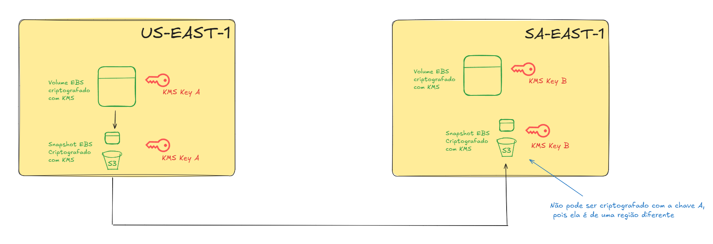

# KMS
- O Key Management Service é o principal serviço da AWS quando o assunto é criptografia, através dele podemos gerenciar as chaves de criptografia. 

- Além disso ele também é 100% integrado ao IAM para controlar autorizações para criptografia ou descriptografia de dados.

- É excelente para auditoria, pois todas as chamadas da API do KMS ficam registradas no CloudTrail.

- A integração com a maioria dos serviços da AWS é bem fácil de configurar, bastando marcar um checkbox pelo console.

- O ==tamanho máxima== de um dado criptograda pelo KMS ==é 4KB==. Se quiser criptografar algo maior que isso, é necessário utilizar **Envelope Encryption**.

- ==Você paga $0.03 a cada 10.000 chamadas para API do KMS.==

- ==É um serviço regional. No entanto, é possível ativar a opção "Multi-region key", o que permitirá que a chave fique disponível em outras regiões== através de replicação.
___
## **Tipos de Chave**
### Symmetric (AES-256)
- ==Uma única chave== para criptografar e descriptografar.
- **Serviços AWS que são integrados com o KMS utilizam esse tipo de chave.**
- Você nunca terá acesso à chave em si, você apenas faz chamadas de API para utilizar ela.
- ==Necessária para **envelope encryption**==.

### Asymmetric (RSA & ECC)
- ==Par de chaves==:
	- Uma chave **pública**, que é utilizada para **criptografar**. 🔒
	- Uma chave **privada**, que é utilizada para **descriptografar**. 🔓
	
- A chave pública é baixável, mas você não pode ter acesso à chave privada.
- **USE CASE: Criptografia fora da AWS, onde o usuário não consegue chamar a API do KMS (Ideal para on-premise)**
 
___
## **O Gerenciamento de Chaves (Customer Master Keys)**
### AWS Owned CMK (Grátis)
- São chaves ==totalmente gerenciadas pela AWS,==  utilizadas para a criptografia de um único serviço específico, não aparecem no painel do KMS. 

- Você não pode visualizar, usar, rastrear ou auditorar esse tipo de chave

- **Exemplos**: SSE-S3, SSE-SQS, SSE-DDB.

### AWS Managed CMK (Grátis)
- Chaves gerenciadas pela AWS para serviços específicos, essas chaves **não podem ser utilizadas em nenhum outro serviço além do qual ela foi definida.**

- ==A **AWS** rotaciona essas chaves automaticamente a cada 1 ano.==

- **Exemplos**: aws/rds, aws/ebs. (aws/`nome-do-servico`)

### Customer Managed CMK | **Criada no KMS** ($1/mês)
- Chaves gerenciadas por você, o consumidor.

- Criada dentro do KMS.

- É possível habilitar ou desabilitar a chave.

- Permite acoplar uma **==Key Policy** para permitir que apenas entidades específicas possam ter acesso à chave.==

- **Auditoria disponível pelo CloudTrail.**

- O tempo mínimo para realizar a rotação é **90 dias**.

### Customer Managed CMK | **Importada** ($1/mês)
- Chaves gerenciadas por você, o consumidor.

- Criada em algum outro serviço de criptografia ou pelo terminal.

- ==**Impossível rotacionar diretamente o conteúdo da chave**. Caso queira fazer isso, você pode apenas importar uma chave nova e deixar de usar a chave antiga.==
___ 
## **Rotação Automática**
- **Gerenciadas pela AWS**: Rotação automática a cada 1 ano.

- **Gerenciada pelo consumidor**: Automática ou sob demanda (primeiramente, precisará ser ativada pelo consumidor através pelo console).

- **Chave Importada (consumidor)**: Só é possível utilizar rotação manual.

___
## **Replicação de um EBS criptografado em outra região**
- Como o KMS é um serviço regional, não é possível usar a mesma chave utilizada para criptografar um EBS na região A em uma região B.

- Por isso, para realizar a replicação de um volume criptografado, é necessário enviar o snapshot de uma região para a outra e durante este envio, selecione uma chave da região B para criptografar o snapshot. 

- Veja em melhores detalhes no diagrama abaixo:

___
### Chaves Multi Região
- Quando a opção "Multi-region" é ativada para uma key, ela criará uma réplica em outras região.

- ==Essas réplicas possuem o mesmo ID, conteúdo e definição de rotação.
==
- Ideal para quando você precisa criptografar em uma região e descriptografar na outra.

- ==**Entenda**: Multi-region não quer dizer global. As réplicas são independentes, apesar de serem cópias. ==

- ==A própria AWS não recomenda utilizar chaves multi região, pois pode ser trabalhoso o gerenciamento das chaves em várias regiões.==

- **USE CASES**: criptografia client-side global, criptografia do Dynamo DB global ou Aurora Global
___
## **Políticas de Chave**
- O controle das chaves KMS é feito através de policy, semelhante às bucket policies do S3.

- Veja os tipos de policies disponíveis:

### Default Key Policy
- Criada automaticamente caso você não defina nenhuma policy para a chave.

- Garante acesso total à chave para todos os usuários da conta que tem permissão de usar o KMS.

### Custom Key Policy
- Define usuários e roles que podem ter acesso à chave.

- Muito útil para gerenciar os acessos cross-account às suas chaves.