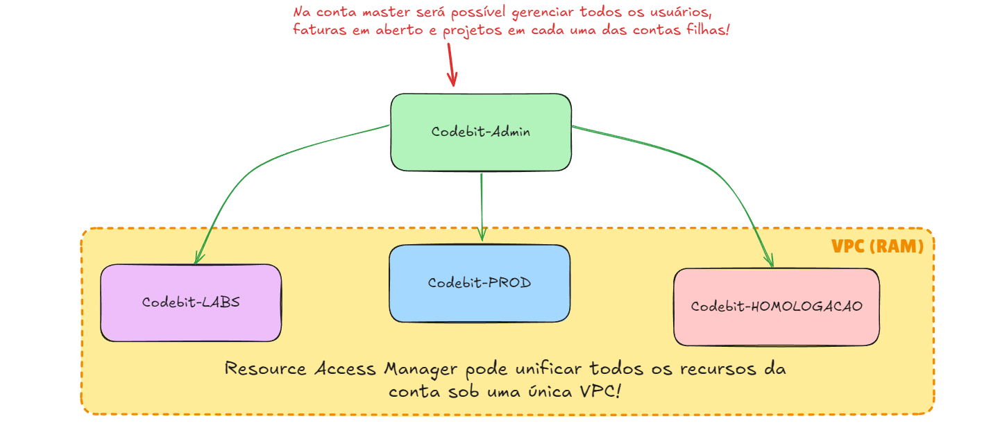

# AWS Organizations
O Organizations tem como papel o gerenciamento de várias contas AWS a partir de uma única conta master, facilita muito o controle de políticas, gerenciamento de acessos e otimização de custos em larga escala. ==É especialmente útil para empresas que utilizam várias contas para diferentes departamentos==, projetos ou ambientes (produção, desenvolvimento, etc.).

- Como mostrado na imagem acima, através do RAM é possível ter uma única rede unificando os recursos de cada uma das contas.

## SCP
- Service Control Policies são políticas do IAM que permitem gerenciar permissões das contas filhas, seus usuários e roles.

- ==Elas **não concedem permissões diretamente**, mas **limitam** as permissões que uma conta pode ter.== Em outras palavras, elas funcionam como uma camada extra de controle para **restringir permissões** que foram atribuídas por políticas do IAM.

- SCPs não podem ser aplicadas na conta gerenciadora.

![[scp-hierarchy.png]]

- No exemplo acima, podemos ver como funciona a hierarquia: Conta A é bloqueada de acessar:
	- S3, pois a OU em que ela pertence tem um deny explícito
	- EC2, pois ela própria tem um deny explícito.

## Características
- **Conta gerenciadora**: Conta responsável pelo gerenciamento dos acessos, infraestrutura e pagamento de todas as outras que são partes da organização.

- **Conta membro**: Contas que pertencem à organização. São gerenciadas pela conta master.

- **Organizational Units (OU)**: Um tipo de hierarquia para organizar contas em grupos lógicos, separando por departamento, projeto ou ambiente. Isso facilita a aplicação de políticas específicas para grupos de contas.

- **Service Control Policies (SCP)**: Permitem definir políticas de permissões que são aplicadas em nível organizacional ou nas OUs. Com SCPs você pode restringir ou permitir acessos para contas vinculadas a uma estrutura da organização.

- **Consolidated Billing**: Com o Organizations, podemos consolidar todos os custos das diferentes contas em uma única fatura, facilitando o rastreamento de despesas.

- **Resource Access Manager (RAM)**: Permite que você compartilhe recursos AWS, como sub-redes VPC, gateways e licenças entre as contas da organização.

## Detalhes
- É um serviço global, obviamente.

- As contas membro só podem fazer parte de uma organização por vez.

- O ==Consolidated Billing== permite gerenciar o pagamento em uma única conta, através dele você soma o uso dos recursos, e como na AWS quanto mais se usa, maior é o desconto... já sabe!

- Tem uma API que permite criar contas direto dentro da organização de maneira bem fácil e rápida

- SCPs não se aplicam a conta root (ela sempre terá `AdministratorAccess`)

- Você pode aninhar OUs (Colocar OU dentro de OU)
- SCPs se aplicam inclusive ao usuário root das contas membros.