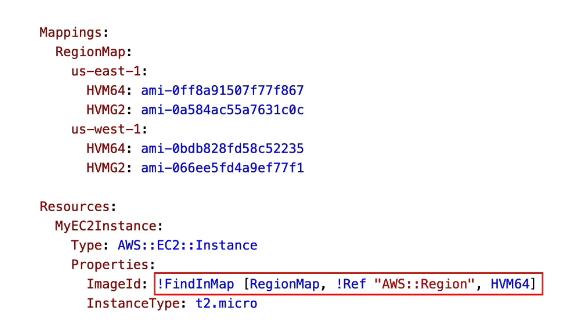
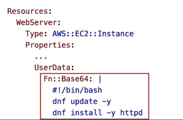

# CloudFormation
Esse é o serviço que permite provisionar e gerenciar recursos da AWS de forma "semiautomática" e segura, ==usando modelos de **infraestrutura como código(IaC)**==. Possibilita a criação e configuração de ambientes complexos por meio de templates que descrevem os recursos necessários (como instâncias EC2, VPCs, banco de dados, etc.) e suas configurações.

## Como funciona
- **Templates**: Você define um template em JSON ou YAML, que especifica todos os recursos AWS que a aplicação precisará.

- **Stacks**: É o conjunto de recursos que o CF cria com base no template. Quando o template for executado, o CF irá criar todos os recursos descritos. Se houver uma falha em algum recurso, o stack pode ser revertido automaticamente.

- **Automação de Deploy**: Ao usar o CF, você pode automatizar a criação, atualização e exclusão de pilhas de recursos. Isso é especialmente útil para garantir consistência entre ambientes (de homologação, teste e produção).

- **Controle de Versão**: Como os templates são definidos como código, você pode armazená-los em sistemas de controle de versão, como o Git, permitindo uma melhor auditoria das configurações.

### Sobre permissões
- o CloudFormation utiliza **IAM Roles** para executar ações em seu nome. Você pode definir uma role específica para o CF assumir ao criar ou atualizar stacks, garantindo que ele tenha apenas as permissões necessárias para os recursos que está gerenciando.

- Alternativamente, caso não seja definida uma role, o CloudFormation utilizará as permissões do usuário que está executando a operação (é necessário que o usuário tem a permissão `iam:PassRole` para que o CF possa assumir a role).
---
## Conceitos Importantes
- **Outputs**: ==Seção opcional de um template do CF que declara valores a serem exportados, os quais poderão ser importados em outras stacks.== _**Caso de uso exemplar**: Ao definir uma stack de rede, você poderia exportar o ID da VPC como ouput e então importá-lo no stack da aplicação._

---
## Funções Intrínsecas
O CloudFormation possui algumas funções built-in bem úteis para a criação de stacks. Vejamos algumas:

- **Ref ⮕** Usada para referenciar um parâmetro ou recurso AWS (ID do recurso). 
	- Em `YAML`: **`!Ref logicalName`**
	- **Obs:** O `!Ref` retorna somente o ID do recurso, se precisar de detalhes adicionais do recurso, use o `!GetAtt`.

- **Fn::GetAtt  ⮕** Retorna o valor de um atributo específico de um recurso AWS. 
	- Em `YAML`:  `!GetAtt logicalNameOfResource.attributeName`
	- **Caso de uso exemplar**: Obter a AZ que uma EC2 foi lançada, seu IP ou DNS público.
	
- **Fn::FindInMap ⮕** Retorna o valor a partir da chave enviada como parâmetro, buscando dentro de um `map` (Estrutura de dados chave-valor em `YAML`). 
	- Em `YAML`:  `!FindInMap [MapName, TopLevelkey, SecondLevelKey`
	- Veja um exemplo abaixo:
	 

- **Fn::ImportValue ⮕** Importa valores exportados em outras stacks.
	- Em `YAML`:  `!ImportValue exportedValueName`

- **Condition Functions (Fn::If, Fn::Not, Fn::Equals, etc...) ⮕** Realizar verificações e validações no momento de criação da stack
	- Em `YAML`:  
		- `!Equals [ value1, value2]`
		- `!If [ conditionName, valueIfTrue, valueIfFalse]`
	- Muito útil para criar stacks dinâmicas, que se adaptam conforme os parâmetros enviados.
	

- **Fn::Base64 ⮕** Converte String para `Base64`.
	- Em `YAML`:  `!Base64 "ValueToEncode"`
	- Muito utilizado para codificar dados a serem usados como `UserData` em uma instância EC2:
	 
---
## Infrastructure Composer
- O CloudFormation é integrado a um serviço bem legal, o Infrastructure composer, **que nos permite visualizar, construir e dar deploy em aplicações de maneira visual**, dá pra provisionar recursos num estilo **==Drag N' Drop==**! Muito legal. [GIF demonstativo](https://docs.aws.amazon.com/images/infrastructure-composer/latest/dg/images/aac_00.gif)
---
## CloudFormation StackSets
- Essa é uma feature que nos permite aplicar stacks do CF em múltiplas contas e/ou regiões de uma só vez, a partir de uma conta de gerenciamento centralizada, tudo em uma única operação

- Este serviço é integrado ao **Organizations.**
---
## Helper Scripts
- Estes são scripts embutidos em uma stack do CloudFromation (na seção `metadata`)

- Auxiliam na configuração inicial de instâncias EC2.
	- Não possuem limitação específica de tamanho, como o ==User Data (que tem limite de 16KB)==
	- **São scripts Python**, portanto são bem mais fáceis de debugar que um User Data convencional em Bash.

### `cfn-init`
- Usado para obter e interpretar a seção `metadata`, instalando pacotes, criando arquivos e iniciando serviços (`daemons`).

- Com este, podemos realizar configurações complexas em uma instância EC2 logo no seu boot inicial.

- ==Deve ser chamado no UserData da instância criada==.

- Todos os logs serão registrados em `var/log/cfn-init.log`

### `cfn-signal`
- Este helper script faz com que o CloudFormation seja notificado se o `cfn-init` foi executado com sucesso ou não.

- ==Ele é rodado logo após o `cfn-init`, também no UserData==.

- Ele é usado em conjunto com o `Wait Condition`, que é uma seção do template que "congela" a stack do CloudFormation até que a instância envie o `cfn-signal`.

- **Cuidado:** Se um erro for retornado para o `cfn-signal`, a stack inteira será deletada (entrará em Rollback), para desabilitar essa opção e debugar manualmente defina a opção de _**Stack Failure**_ como "_**Preserve successfully provisioned resources**_"
---
## Deletion Policy
- Dentro do CloudFormation é possível definir uma política de deleção personalizada para quando a stack for excluída (ou caso o próprio recurso seja excluído). Veja os tipos de policies:

- **`Delete`**: Comportamento padrão, recurso é deletado (não funciona em um bucket S3 que não estiver vazio)
- **`Snapshot`**: Criará um snapshot final do recurso quando a stack for excluída.
- **`Retain`**: Recurso permanecerá mesmo se a stack for deletada.

---
## Stack Policies
- As Stack Policies são usadas para proteger recursos específicos dentro de uma stack do CloudFormation contra atualizações acidentais.
- Um exemplo prático, seria aplicar uma policy que impeça a atualização de um banco de dados crítico durante uma atualização da stack, garantindo que ele permaneça intacto.
- As Stack Policies são definidas em formato JSON e podem ser aplicadas no momento da criação da stack ou atualizadas posteriormente.
---
## Custom Resources
- **Através do custom resources, podemos estender as funcionalidades do CloudFormation para recursos que não são nativamente suportados pelo serviço**.
- Com eles, é possível definir lógica personalizada para criar, atualizar ou deletar recursos específicos, utilizando AWS Lambda ou outros serviços.
- Também são ==especialmente úteis quando precisamos integrar o CloudFormation com serviços externos ou realizar operações complexas que vão além das capacidades padrão do CloudFormation==.
	- Um exemplo prático seria criar:
		- Um recurso que provisiona um serviço de terceiros via API (Lambda) durante a criação da stack.
		- Ou um recursos que executa a limpeza total dos objetos de um bucket S3 antes de sua deleção (Impedindo erros de deleção por não estar vazio).
- Sintaticamente, é definido usando o tipo de recurso `AWS::CloudFormation::CustomResource` ou `AWS::CloudFormation::Resource` em conjunto com uma função Lambda que executa a lógica personalizada.
- Um detalhe técnico importante é que o Lambda deve enviar uma resposta de volta ao CloudFormation para indicar o sucesso ou falha da operação, garantindo que a stack seja gerenciada corretamente.
	- A resposta é enviada para uma URL pré-assinada fornecida pelo CloudFormation.

---
## Rollbacks
- **Falha na criação de uma Stack:**
	- ==**Por padrão**: Todos os recurso sofrem rollback (serão apagados)==, os logs fornecerão detalhes.
		- Há também a opção de desabilitar o rollback e solucionar o problema verificando diretamente o recurso.

- **Falha na atualização de uma Stack:**
	- A Stack fará um ==rollback automático para o estado funcional mais recente==.

- **Falha no rollback**:
	- Nesse caso ==será necessário consertar os recursos manualmente, e então chamar a **API ContinueUpdateRollback**== diretamente do console ou CLI, isso fará com que o rollback tente ser feito novamente.

---
## Change Sets
- O CloudFormation nos permite executar uma simulação de atualização de stack antes de aplicá-la de fato, isso é feito por meio dos **Change Sets**.

- Com ele podemos ver exatamente quais recursos serão criados, atualizados ou deletados antes de aplicar as mudanças.

- Podemos imaginar o Change Set como o `terraform plan` ou `--dryrun` do CloudFormation.

-	Feita a validação, podemos então aplicar as mudanças com segurança.