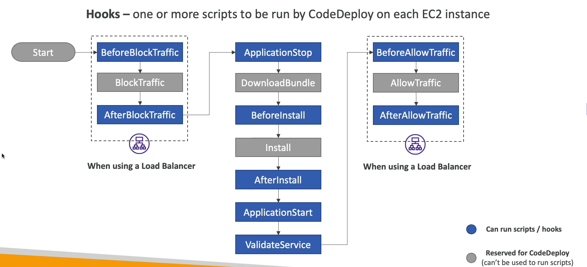

# CodeDeploy

- O CodeDeploy é um serviço de implantação automatizada da AWS que facilita a implantação de aplicações em instâncias EC2, servidores on-premises e funções Lambda.
  - Deploys na própria AWS não geram custos adicionais, apenas o uso de recursos subjacentes (EC2, S3, etc).

- Ele permite que você automatize o processo de implantação, reduzindo o tempo de inatividade e minimizando erros humanos durante as atualizações de software.

## Conceitos Principais

### Aplicações e Deployment Groups
- Uma aplicação no CodeDeploy é uma coleção lógica de recursos que você deseja implantar.

- Um Deployment Group é uma coleção de instâncias ou servidores onde a aplicação será implantada

### Agent do CodeDeploy
- O CodeDeploy Agent é um software que deve ser instalado nas instâncias EC2 ou servidores on-premises para permitir a comunicação com o serviço CodeDeploy.

- Ele gerencia o processo de implantação, baixando os artefatos e executando os scripts conforme definido no arquivo AppSpec.

### Ciclo de Vida da Implantação
- O CodeDeploy suporta diferentes ciclos de vida de implantação, incluindo Blue/Green e In-Place.

- Blue/Green envolve a criação de um novo ambiente para a nova versão da aplicação, enquanto In-Place atualiza a aplicação diretamente nas instâncias existentes.

### Rollback Automático
- O CodeDeploy pode ser configurado para reverter automaticamente para a versão anterior da aplicação em caso de falhas durante o processo de implantação, garantindo maior confiabilidade.

- **Você pode configurar o disparo de um rollback com base em alarmes do CloudWatch** ou falhas de implantação.

### AppSpec File
- O arquivo AppSpec é um arquivo YAML ou JSON que define como o CodeDeploy deve implantar a aplicação.

- Ele especifica os arquivos a serem copiados, os scripts a serem executados em diferentes fases do ciclo de vida da implantação, e outras configurações necessárias.

#### Hooks de Deploy
- Os hooks permitem que você execute scripts em pontos específicos durante o processo de implantação, como antes da instalação, após a instalação, antes da reinicialização, etc.

### Estratégias de Implantação
- O CodeDeploy oferece várias estratégias de implantação, incluindo:
  - **All-at-Once**: Implanta a nova versão em todas as instâncias simultaneamente.

  - **Half-at-a-Time**: Implanta a nova versão em metade das instâncias primeiro, e depois na outra metade.

  - **One-at-a-Time**: Implanta a nova versão em uma instância de cada vez.
  
  - **Rolling Update**: Implanta a nova versão em lotes, reduzindo o impacto em caso de falhas.
  
  - **Canary**: Implanta a nova versão em uma pequena porcentagem de instâncias antes de expandir para o restante.
  
  - **Blue/Green**: Cria um novo ambiente para a nova versão, permitindo uma transição suave.

## Deploy em Funções Lambda
- Como dito anteriormente, o CodeDeploy também suporta implantações em funções Lambda.

- A mudança de versão é feita de forma automática, e você também pode configurar o tráfego para ser dividido entre a versão antiga e a nova, permitindo testes A/B.

  - A mudança de tráfego pode ser feita de forma gradual, com base em porcentagens definidas. Sendo possível definir uma estratégia de implantação canary ou linear.
 
  - **Linear**: o tráfego é movido em incrementos iguais em intervalos regulares até que 100% do tráfego esteja na nova versão.

  - **Canary**: uma pequena porcentagem do tráfego é movida para a nova versão inicialmente, e após um período de avaliação, o restante do tráfego é movido.

## Deploy em Instâncias EC2
- Para identificar as instâncias que receberão o deploy, o CodeDeploy pode utilizar:
  - Tags do EC2

  - Auto Scaling Groups

- Quando a instância/ASG possui um Load Balancer associado, o CodeDeploy pode gerenciar o processo de remoção e adição das instâncias no LB durante o deploy, garantindo que o tráfego não seja direcionado para instâncias em processo de atualização.

### Sobre os Hooks
- No processo de deploy, você pode definir scripts para serem executados em diferentes fases do ciclo de vida da implantação, isto é feito através da seção `hooks` no arquivo AppSpec:

  - `ApplicationStop`: Executado antes de qualquer arquivo ser copiado. 
    - Aqui você pode parar serviços.
    - Um detalhe importante sobre essa etapa é que o script a ser executado para parar a aplicação será o da versão anterior, ou seja, o CodeDeploy primeiro executa esse hook e depois baixa os novos arquivos. Isto ocorre pois apenas a versão que iniciou a aplicação sabe como pará-la corretamente (Imagine que o serviço mudou de nome entre uma versão e outra, por exemplo).

  - `DownloadBundle`: Executado após o bundle da aplicação ser baixado, mas antes de ser descompactado. 
    - Não é possível executar scripts neste estágio.
  
  - `BeforeInstall`: Executado antes dos arquivos serem copiados para a instância.
    - Aqui você pode fazer backup de arquivos existentes, por exemplo.

  - `Install`: Executado para copiar os arquivos para a instância.
    - Não é possível executar scripts neste estágio.

  - `AfterInstall`: Executado logo após os arquivos serem copiados para a instância.
    - Aqui você pode configurar permissões, mover arquivos, etc.
 
  - `ApplicationStart`: Executado após os arquivos serem copiados e configurados.
    - Aqui você pode iniciar serviços.
 
  - `ValidateService`: Executado após a aplicação ser iniciada.
    - Aqui você pode executar testes para garantir que a aplicação está funcionando corretamente (como um `curl` para um endpoint, por exemplo).
  
- Caso a arquitetura conte com um Load Balacer, existem hooks adicionais para gerenciar o processo de remoção e adição das instâncias no LB:
  - `BeforeBlockTraffic`: Executado antes de a instância ser removida do Load Balancer.
  
  - `AfterBlockTraffic`: Executado após a instância ser removida do Load Balancer.
  
  - `BeforeAllowTraffic`: Executado antes de a instância ser adicionada de volta ao Load Balancer.
  
  - `AfterAllowTraffic`: Executado após a instância ser adicionada de volta ao Load Balancer.

- Caso o Deploy o deploy esteja sendo efetuado em uma função lambda, os únicos hooks disponíveis são:
  - `BeforeAllowTraffic`
  - `AfterAllowTraffic`

O diagrama abaixo mostra o fluxo de execução dos hooks durante o processo de deploy:

## Deploy no ECS
- O CodeDeploy também suporta implantações em serviços do ECS (Elastic Container Service), permitindo atualizações seguras de aplicações em contêineres.

- Para utilizar o CodeDeploy no ECS, você deve configurar o ECS para usar o CodeDeploy como provedor de implantação.

- O processo de implantação no ECS envolve a criação de uma nova tarefa com a nova versão da aplicação e a substituição gradual das tarefas antigas pelas novas, garantindo alta disponibilidade durante o processo.

- Além do `appSpec.yml`, você também deve criar um arquivo `taskdef.json`, que define a nova tarefa do ECS a ser implantada.
  - O `taskdef.json` deve conter a definição completa da tarefa, incluindo a imagem do contêiner, recursos, variáveis de ambiente e outras configurações necessárias.

### Os Hooks no ECS

- No processo de deploy no ECS, os hooks disponíveis são:
  - `BeforeInstall`: Executado antes da nova tarefa ser iniciada.
  
  - `AfterInstall`: Executado após a nova tarefa ser iniciada.

  - `AfterAllowTestTraffic`: Executado após o direcionamento de tráfego de teste para a nova tarefa. Este hook é utilizado para validar se a nova tarefa está funcionando corretamente antes de direcionar todo o tráfego para ela.

  - `BeforeAllowTraffic`: Executado antes de todo o tráfego ser direcionado para a nova tarefa.

  - `AfterAllowTraffic`: Executado após todo o tráfego ser direcionado para a nova tarefa.

## Outros Detalhes
- Ao fazer um deploy Blue/Green em um Auto Scaling Group, é possível definir a opção de terminação das instâncias antigas (blue) com a flag `BlueInstanceTerminationOption`, que pode assumir os valores:
  - `TERMINATE`: As instâncias antigas são terminadas imediatamente após o deploy ser concluído.
  - `KEEP_ALIVE`: As instâncias antigas são mantidas ativas após o deploy, permitindo que você as utilize para testes ou rollback manual, se necessário. O valor máximo do keep alive é de 48 horas (2880 minutos).