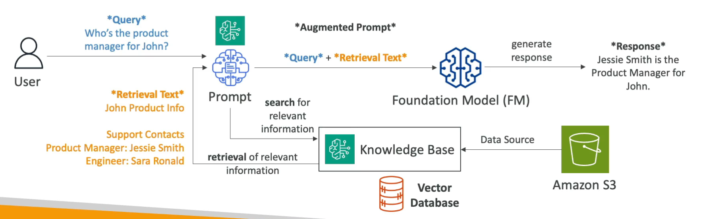

# RAG

- O RAG, ou Retrieval-Augmented Generation, é uma **técnica que combina a geração de texto com a recuperação de informações relevantes de uma base de dados ou fonte de conhecimento externa**.

- Isso permite que o modelo de linguagem gere respostas mais precisas e informadas, que não poderia ser obtida apenas com o conhecimento prévio dos dados originais de treinamento do modelo.

- **O RAG é muito útil para casos onde o modelo precisa acessar informações atualizadas ou bastante específicas**, como notícias recentes, dados de uma database externa, ou qualquer informação que não estava presente no conjunto de dados de treinamento do modelo.

- Para que o modelo possa fazer a busca na fonte externa, é necessário que os dados estejam vetorizados, ou seja, transformados em vetores numéricos que representem o conteúdo semântico dos dados.
  - Para gerar o conteúdo vetorizado, é necessário usar um modelo de embeddings, que é um modelo de linguagem treinado para criar representações vetoriais de palavras, frases ou documentos.

  - O armazenamento dos dados vetorizados deve ser feito em um banco de dados especializado, como o Postgres ou OpenSearch com extensão de vetor, S3 Vectors, Pinecone, etc.

## Exemplo de RAG

- Imagine que, em um sistema empresarial que possui IA integrada, um usuário faça a seguinte pergunta: "Quem é o Gerente do John?".

  - Essa é uma pergunta bastante específica, e o modelo de linguagem pode não ter essa informação em seu conhecimento prévio, ou seja, nos dados de treinamento.

- Desta forma, antes que o prompt seja passado para o modelo, o sistema irá realizar uma busca na base de dados vetorizada.

- Ao encontrar informação, por exemplo "O gerente do John é o Jessie", o sistema irá concatenar essa informação ao prompt original, e passá-lo para o modelo de linguagem.

- Assim, o modelo de linguagem irá gerar uma resposta mais precisa e informada, como "O gerente do John é o Jessie", ao invés de uma resposta genérica ou incorreta, como "Desculpe, não sei quem é o gerente do John".

- Por isso o nome **Retrieval-Augmented Generation**:
  - **Retrieval**: o processo de busca e recuperação de informações relevantes de uma fonte externa.
  - **Augmented Generation**: O processo de aumentar o prompt original com base nas informações recuperadas, para gerar uma resposta mais precisa e informada.

