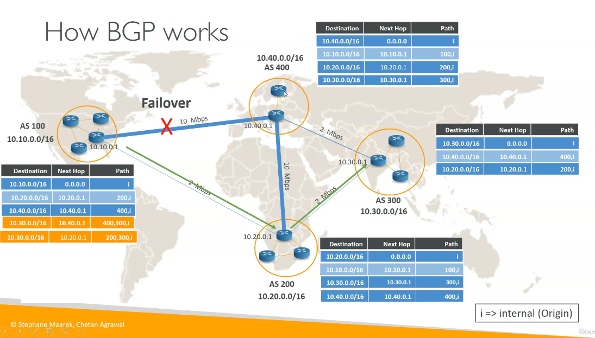

# BGP

## O que é?
- O Border Gateway Protocol (BGP) é o protocolo de roteamento usado para trocar informações de roteamento entre sistemas autônomos (AS) na Internet. Sendo um protocolo de roteamento externo, ele é fundamental para a operação da Internet, permitindo que diferentes redes se comuniquem e troquem informações de roteamento sem a necessidade de mapear rotas manualmente.

> **Observação**: Um sistema autônomo (AS) é uma coleção de redes IP e roteadores sob o controle de uma única entidade administrativa que apresenta uma política de roteamento comum para a Internet, podemos considerar um AS como um provedor de serviços de Internet (ISP), mas isso não é uma regra, pois um AS pode ser uma grande empresa, universidade ou qualquer organização que gerencie sua própria rede.

## Na AWS
- O BGP é um tópico bem comum na Networking Specialty, pois é muito usado no Site-to-Site VPN e no AWS Direct Connect. 

- Ele é usado para anunciar rotas entre a rede local do cliente e a rede da AWS, permitindo que o tráfego seja roteado de forma eficiente entre os dois ambientes.

- Um detalhe bem importante é que **o limite de rotas propagadas dinamicamente via BGP em uma VPC Route Table é de 100 rotas**.
  - Este é um Hard Limit da AWS e não pode ser aumentado via chamado de suporte.

  - Como contornar o limite de 100 rotas do BGP:
    - **Sumarização de Rotas (Agregação de CIDR)**: Agrupar múltiplos prefixos específicos em um único prefixo mais amplo (ex: combinar 10.1.0.0/16 e 10.3.0.0/16 em 10.0.0.0/14).

    - **Migração para Transit Gateway (TGW)**: O Transit Gateway suporta até 10.000 rotas em suas próprias TGW Route Tables, sendo a solução ideal para grandes redes híbridas.

## Modo de operação

- Existem dois tipos de BGP: o eBGP (External BGP) e o iBGP (Internal BGP). 

  - O eBGP é usado para trocar informações de roteamento entre diferentes sistemas autônomos.
  
  - Já o iBGP é usado para trocar informações de roteamento dentro do mesmo sistema autônomo.

- A decisão de roteamento é influenciada por alguns parâmetros, como:

  - **AS Path (AS_PATH)**: O caminho de sistemas autônomos que uma rota percorreu. Rotas com caminhos mais curtos são preferidas. Funciona entre ASs.
    - O AS_PATH de uma rota pode ser modificado manualmente para influenciar a escolha de rotas, adicionando ou removendo ASs fictícios do caminho (Não é possível remover ASs legítimos do caminho), isso é chamado de **AS_Path Prepending**.
  
  - **Local Preference (LOCAL_PREF)**: Um valor configurado para ==indicar a preferência de uma rota dentro de um AS==. Rotas com maior local preference são preferidas. Funciona dentro de um AS.
  
  - **Multi-Exit Discriminator (MED)**: Um valor usado para ==influenciar a escolha de rotas entre diferentes AS==. Rotas com menor MED são preferidas. Funciona entre ASs.

  - **Weight**: ==Peso atribuído a uma rota, o roteamento escolhe a rota com maior peso==. O weight é específico para o roteador local e não é propagado para outros roteadores, outro detalhe importante é que **esse parâmetro é específico de roteadores da Cisco e só funciona dentro do AS**.

## Diagrama de funcionamento do BGP

- O diagrama acima mostra como funciona a tabela de rotas do BGP. Repare que as linhas em amarelo são rotas propagas de outros ASs, enquanto as linhas em azul são rotas propagadas dentro do mesmo AS.

- Note também sobre a possibilidade de failover ao mapearmos multiplos caminhos para o mesmo destino, como mostrado no diagrama acima. O BGP é capaz de detectar falhas em um caminho e redirecionar o tráfego para outro caminho disponível, garantindo a continuidade da comunicação entre os sistemas autônomos.

- Como dito no tópico acima, o PATH preferido é sempre aquele com o menor número de ASs, ou seja, o caminho mais curto.