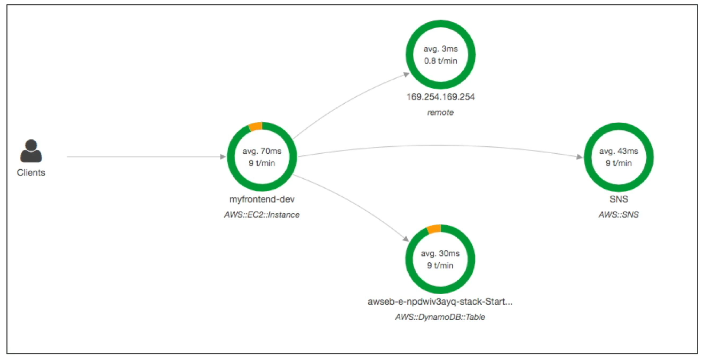

# X-Ray

- O Amazon X-Ray é um serviço utilizado para traçar o fluxo de trabalho das suas aplicações na AWS e como elas se interconectam, **tudo de maneira visual** e detalhada, por meio de gráficos e mapas de dependências.

- Abaixo temos um grafo exibido pelo X-Ray, mostrando como os serviços estão interconectados:

- Ele é ==especialmente útil quando precisamos depurar e identificar gargalos em aplicações distribuídas== (microsserviços). Se o exame falar sobre troubleshooting de aplicações distribuída, então a resposta vai estar relacionada ao X-Ray.

- Serviços compatíveis:
	- **Lambda**
		- Ao usar o X-Ray em uma Lambda, é necessário habilitar o **active tracing** na configuração da função.
	- **Instâncias EC2 (ou servidores on-premises)** - Via SDK ou agente do X-Ray.
	- **ECS**
	- **Elastic Beanstalk**
	- **API Gateway**

## Casos de Uso
- Identificar gargalos em aplicações distribuídas.
- Analisar as dependências entre os serviços.
- Descobrir a causa raiz de erros e gargalos de desempenho.
- Identificar usuários que estão sendo impactados por erros ou lentidão.

## Como usar o X-Ray
- Há duas maneiras principais de usar o X-Ray:
	1. **SDK do X-Ray**: Você pode instrumentar seu código usando o SDK para coletar dados de tracing. Ele está disponível para várias linguagens de programação, como Java, Python, Node, etc.
	
	2. **Daemon do X-Ray**: Para aplicações que não podem ser instrumentadas diretamente, você pode usar o Daemon do X-Ray para coletar dados de tracing. O agente é um processo que roda em segundo plano e coleta dados de tracing de suas aplicações através da interceptação de chamadas de rede.
		- Neste caso, é importante que o host onde o agente está rodando tenha as permissões necessárias para enviar dados para o X-Ray.

## Tracing
- O X-Ray utiliza o conceito de **tracing** para coletar dados sobre as solicitações que passam por suas aplicações. Ele gera um **trace** para cada solicitação, que é composto por **segments** e **subsegments**.
	- **Segment**: Representa uma unidade de trabalho, como uma solicitação HTTP ou uma chamada a um banco de dados.
	
	- **Subsegment**: Representa uma parte específica do trabalho, como uma consulta SQL ou uma chamada a outro serviço.

- Você pode adicionar annotations e metadata aos seus traces para facilitar a análise e a identificação de problemas, estes funcionam como tags e chaves-valor, respectivamente.

## Sampling
- O X-Ray utiliza um mecanismo de sampling para controlar a quantidade de dados de tracing (requisições) que são coletados e enviados para o serviço, isso ajuda a reduzir custos e o impacto na performance da aplicação.
 
 - Por padrão, o X-Ray coleta dados da **primeira requisição de cada minuto** e depois **coleta 1 em cada 10 requisições subsequentes**.

 - Você pode configurar o sampling para coletar mais ou menos dados, dependendo das necessidades da sua aplicação e do seu orçamento.

	- O critério é definido baseado no **reservoir** (reservatório) e na **sampling rate** (taxa de amostragem). O reservoir é o número de requisições que serão coletadas por minuto, e a taxa de amostragem é a porcentagem de requisições que serão coletadas após o reservoir ser preenchido.

	- Ao atualizar a regra de sampling, as mudanças entram em vigor imediatamente, e o X-Ray começa a coletar dados de acordo com a nova configuração, sem a necessidade de reiniciar suas aplicações ou serviços. Isto é feito através de uma chamada para a API `xray:GetSamplingRules`, que retorna as regras de sampling atualizadas, e o X-Ray aplica essas regras em tempo real para determinar quais requisições devem ser amostradas.

## Anottations e Metadata
- Como dito anteriormente, estas são formas de adicionar informações adicionais aos seus traces, para facilitar a análise e a identificação de problemas.
	- **Annotations**: São pares chave-valor que **são indexados e podem ser usados para filtrar e pesquisar traces**. 
		- Por exemplo, você pode adicionar uma annotation com o nome do usuário ou o tipo de dispositivo.
	
	- **Metadata**: São pares chave-valor que **não são indexados**, mas podem ser usados para armazenar informações adicionais sobre o trace. 
		- Por exemplo, você pode adicionar metadata com detalhes de uma exceção ou informações de depuração.