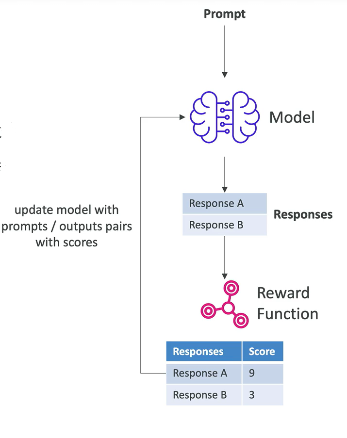
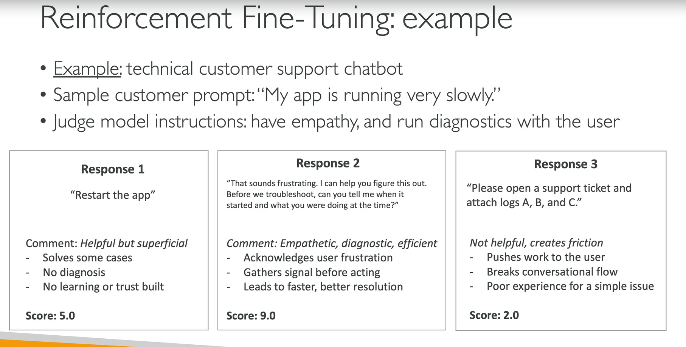

# Amazon Bedrock

- O Bedrock é um seviço de IA generativa totalmente gerenciado, ele fornece uma interface de aceesso a diversos ([modelos de fundação](../certificacoes/ai-practitioner/foundation-models.md)), como Claude, Llama, Stable Diffusion, Titan e muito mais.

- O modelo de custo é pay-per-use, portanto você só é cobrado pelas requisições e quantidade de tokens processados.

## Modelos de Fundação

- Como dito anteriormente, diversos modelos de fundação estão disponíveis no Bedrock.

- É importante esclarecermos que os modelos usados na sua conta AWS pertencem a você, e nenhum dado ou informação processados por eles serão usados para treinamento do modelo de fundação.

  - Isso torna as aplicações construídas com o Amazon Bedrock extremamente seguras para o uso corporativo, já que nenhuma regra ou segredo de negócio será usada para retreinar o modelo, **como ocorre em IAs públicas.**

## Fine Tuning de Modelos

- Em poucas palavras, o Fine Tuning é a prática de modificar o comportamento de um modelo de fundação usando dados produzidos por você.

- O Fine Tuning fará a mudança de pesos do modelo de fundação, o que **pode ser um processo demorado e custoso, dependendo do modelo e da quantidade de dados usados**.
  - **Observação**: pesos são os parâmetros que o modelo de fundação usa para processar e reconhecer as informações que recebe, são eles que definem o resultado (output) que o modelo irá gerar.

- Os dados de treinamento precisam:
  - Seguir um formato específico, que varia de acordo com o modelo de fundação escolhido.
    - Ex: arquivo JSON onde cada linha é um exemplo de treinamento, contendo um prompt e uma resposta esperada.

  - Estar armazenados em um bucket S3.

- Detalhe, nem todos os modelos de fundação disponíveis no Bedrock suportam o fine tuning, é importante verificar a documentação do modelo escolhido para saber se ele suporta ou não essa funcionalidade.

### Tipos de Fine Tuning

#### Supervised Fine Tuning
- Melhora a performance do modelo em uma tarefa específica.

- Utiliza exemplos rotulados (*labeled examples*) com pares de entrada-saída (Ex: prompt + resposta esperada).

#### Reinforcement Fine Tuning
- Melhora o modelo usando **aprendizado baseado em feedback**.

- Você provê APENAS os dados de entrada/treinamento (O prompt).

- Você define uma **reward function (função de recompensa)** que valida as repostas e julga se elas foram boas ou não.
  - A definição dessas funções depende do tipo de tarefa e como ela deve ser avaliada.

  - Se for uma tarefa objetiva, com uma resposta certa clara, você pode usar uma função lambda para a avaliação da resposta.

  - Já se a tarefa for subjetiva, pode-se usar um outro modelo (modelo juiz) para julgar as respostas com base em instruções de validação.

- Com isso, o modelo aprenderá de maneira iterativa com base na pontuação de suas respostas, entregues pela função.

- Veja abaixo um exemplo de Fine Tuning usando um modelo juiz:

#### Distillation Fine Tuning

- O processo de distillation é uma técnica de **compressão de modelos**, onde um modelo menor (modelo estudante) é treinado para imitar o comportamento de um modelo maior (modelo professor).

- O principal objetivo é criar um modelo mais leve, eficiente e de baixo custo.

- O modelo estudante é treinado usando as saídas do modelo professor como rótulos, em vez de usar dados rotulados tradicionais.

