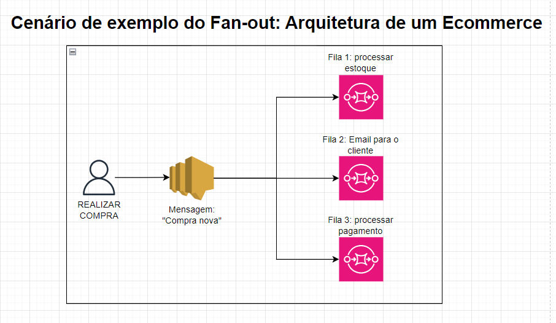

# SQS
É um serviço de mensageria totalmente gerenciado que permite o envio, armazenamento e recebimento de mensagens entre componentes de uma aplicação distribuída sem a necessidade de gerenciar servidores ou infraestrutura.

## Filas de Mensagens
O SQS oferece dois tipos de filas:
- **Standard Queue**: Garante entrega de mensagens pelo menos uma vez, mas ==não mantém a ordem das mensagens.== Ideal para sistemas distribuídos que podem lidar com possível duplicidade de mensagens. 
  - Quantidade ilimitada de transações por segundo.

- **FIFO Queue (First In, First Out)**: ==Garante a entrega de mensagens exatamente uma vez e preserva a ordem de envio.== Ideal para casos onde a ordem de processamento das mensagens é crítica, como em transações financeiras.
  - Limite de 300 transações por segundo (ou até 3.000 com lotes).

## Vantagens do SQS
- **Desacoplamento de Sistemas**: O SQS permite que componentes de uma aplicação se comuniquem sem depender uns dos outros diretamente. 
  - Um sistema pode enviar uma mensagem para a fila e continuar seu processamento, enquanto outro sistema pode processar essa mensagem posteriormente, garantindo escalabilidade e tolerância a falhas.

- **Escalabilidade Automática**: O SQS se ajusta automaticamente conforme a demanda aumenta ou diminui, sem necessidade de provisionamento manual de recursos, lidando de maneira eficiente com grandes volumes de mensagens.

- **Mensagens Temporárias**: As mensagens podem ser armazenadas em uma fila por um tempo definido **(até 14 dias)**, dando aos componentes tempo para processá-las. **Se a mensagem não for processada dentro do período, ela expira.**

- **Configuração de Retries (Dead Letter Queues)**: Você pode ==configurar filas de dead-letter para capturar mensagens que falharam no processamento após várias tentativas==, facilitando o diagnóstico e correção de problemas sem perda de mensagens.

## Message Visibility Timeout
- Quando uma mensagem é recuperada por um consumidor, ela ficará invisível para outros consumidores.

- **Por padrão, este tempo é de 30 segundos.** (Isso significa que a mensagem tem 30 segundos para ser processada)

- Depois que esse timeout acabar, a mensagem ficará visível novamente para outros consumidores (inclusive para o consumidor que não processou a mensagem a tempo).

- É possível fazer com que o consumidor chame a API **ChangeMessageVisibility** para pedir mais tempo até dar timeout.

- **CUIDADO**: Tempo de mais pode deixar uma mensagem presa com um consumidor que está crashado, tempo de menos pode fazer com que nenhum consumidor processe a mensagem a tempo.

## Fan-out
- O fan-out é o nome dado a uma arquitetura onde uma única mensagem é enviada para múltiplas filas SQS através do SNS (Simple Notification Service).

- Essa estratégia deve ser aplicadas em contextos onde temos uma arquitetura desacoplada com múltiplos processos que ocorrem ao disparar de um mesmo evento. 
  - Vamos considerar por exemplo, uma aplicação de ecommerce, onde deveríamos colocar 3 filas diferentes para uma mensagem de "Usuário realizou uma nova compra", vejamos no diagrama abaixo:

> **Observação**: Para que este serviço funcione corretamente, é necessário que a fila SQS tenha uma política que permita o SNS realizar publicações nela.

## Long Pooling
- Quando um consumidor faz uma requisição por uma mensagem em uma fila que está vazia, ele pode opcionalmente "esperar" até que uma mensagem chegue. O nome disso é Long pooling.

- O Long Pooling fará com que a quantidade de chamadas de API feitas para o SQS reduza, ao mesmo tempo que a eficiência da aplicação é mantida.

- **É possível definir de 1 a 20 segundos.**

- Long pooling é sempre preferível do que short pooling.

## Anotações
- Em exames de certificação, sempre que cair uma questão relacionado ao desacoplamentos (decouple) de aplicações, lembre-se do SQS, pois eles usam exatamente essa terminologia.

- ==As mensagens podem pesar até 256KB de texto em qualquer formato==.

- O nome de uma fila FIFO necessariamente deve terminar com ".fifo"

- O SQS é **pull-based**, e não push-based. Ou seja, os consumidores precisam fazer polling na fila para receber mensagens.

- ==Dead Letter Queues devem ser do mesmo tipo da fila principal==. Ou seja, se a fila principal for FIFO, a DLQ tem que ser FIFO também. Se a principal for *Standard*, então a DLQ tem que ser *Standard* também.
