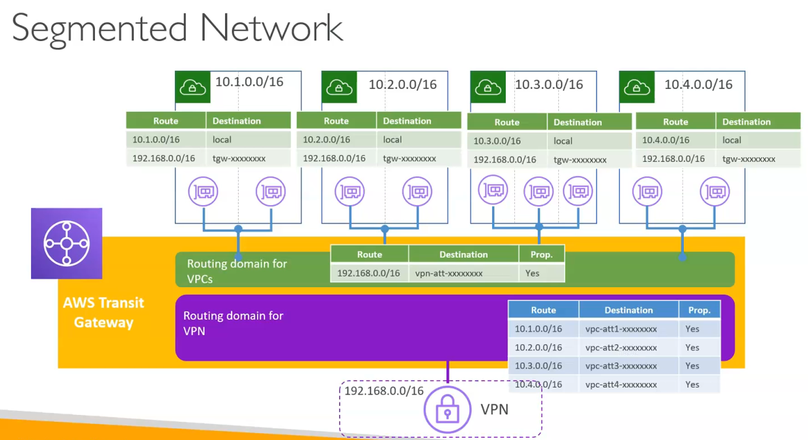

# Transit Gateway

Serviço que permite conectar múltiplas VPCs, contas da AWS e redes on-premises através de um único gateway centralizado. Ele simplifica a interconexão de redes em grande escala, permitindo que você crie uma malha de rede altamente escalável e gerenciável.

## Características

- ==A principal ideia por trás deste serviço é unir todas as redes conectadas em um único hub central, simplificando a topologia==.

- Diferentemente do VPC Peering, que não é transitivo (não permite que uma VPC conectada a outra VPC se comunique com uma terceira VPC), o Transit Gateway permite que todas as redes conectadas se comuniquem entre si, desde que as rotas estejam configuradas corretamente.
  - A comunicação de cada nó de rede com todos os outros é chamado de **Full Mesh**, enquanto que a comunicação de cada nó de rede com apenas um outro nó é chamado de **Point-to-Point**.

- Suporta milhares de conexões, facilitando a expansão de rede à medida que novas VPCs ou redes precisam ser integradas.

- A base fica em uma única região, porém é possível acoplar redes que estão em outras regiões.

- **Este serviço implementa o BGP (Border Gateway Protocol) para facilitar a troca de rotas entre redes on-premises e VPCs conectadas ao Transit Gateway**, otimizando o roteamento dinâmico.

  - Em exames de certificação, se cair uma questão sobre roteamento dinâmico entre redes on-premises e VPCs falando de BGP, lembre-se do Transit Gateway.

## Acoplamentos
- É possível acoplar um transit gateway com:
  - Um ou mais VPCs
  - Outro transit gateway (mesmo em outra região)
  - Conexões SD-WAN de terceiros
  - VPNs
  - Gateways Direct Connect
  - Network Function (do AWS Network Firewall)

## As rotas no TGW
- O TGW centraliza as rotas de todas as redes conectadas a ele, porém cada VPC também tem sua route table, que aponta para o TGW.

- Uma vez que a VPC é acoplada ao TGW e a tabela de rotas da subrede acoplada ajustado para apontar para o TGW a partir de uma rota genéria, como 10.0.0.0/8 ou 0.0.0.0/0, as rotas de saída para outras VPCs são totalmente gerenciados pelo TGW.

## Routing Domains
- No Transit Gateway, routing domains são agrupamentos lógicos de tabelas de rotas, que podem ser usados para isolar o tráfego entre diferentes grupos de VPCs e redes on-premises conectadas ao TGW.

- Essa funcionalidade permite que diferentes grupos de VPCs e redes on-premises se comuniquem entre si de forma isolada.

- Você pode, por exemplo, fazer com que uma VPN se conecte com todas as VPCs acopladas ao TGW e, ao mesmo tempo, impedir que uma VPC se comunique com outra VPC acoplada ao mesmo TGW.
  - Isto é feito através da criação de um routing domain para a VPN e outro para as VPCs, garantindo que o tráfego seja isolado entre eles.
  
  - Diagrama visual da arquitetura:

  

## Considerações sobre AZs
- Apesar do acoplamento do TGW ser feito a nível de VPC, o roteamento opera a nível de AZ, o que significa que **cada AZ precisa ter uma sub-rede acoplada ao TGW para que o tráfego possa ser roteado corretamente entre as VPCs e redes on-premises conectadas**.

## Appliance Mode

- O Appliance Mode é uma funcionalidade ativada no VPC Attachment do Transit Gateway, projetada para arquiteturas de inspeção centralizada com appliances stateful (firewalls, IDS/IPS).

- Por padrão, o TGW prioriza manter o tráfego na mesma AZ de origem (**AZ Affinity**). Na volta do tráfego (resposta), ele pode usar ECMP e entregar o pacote por uma AZ/ENI diferente da que recebeu a ida.

  - Esse fluxo de ida por uma AZ (Firewall A) e volta por outra AZ (Firewall B) faz com que o Firewall B receba tráfego de uma sessão que ele não conhece, descartando os pacotes (Stateful Drop), causando problemas de conectividade.

- Quando o Appliance Mode é ativado no attachment da VPC de Inspeção, ele força o TGW a usar a mesma AZ/ENI do anexo tanto para o tráfego de ida quanto para o de volta durante toda a vida daquela sessão TCP/UDP, garantindo a simetria no firewall, e o conhecimento total do estado da sessão, evitando o problema de Stateful Drop.

- Deixar o appliance mode desativado é ideal para tráfego entre VPCs comuns sem firewalls no meio, mantendo a menor latência e evitando custos de dados cross-AZ desnecessários.