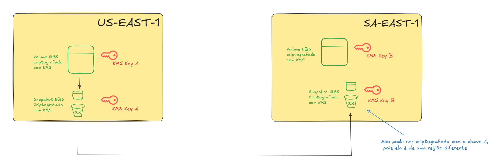

# KMS
- O Key Management Service é o principal serviço da AWS quando o assunto é criptografia, através dele podemos gerenciar as chaves de criptografia. 

- Além disso ele também é 100% integrado ao IAM para controlar autorizações para criptografia ou descriptografia de dados.

- É excelente para auditoria, pois todas as chamadas da API do KMS ficam registradas no CloudTrail.

- A integração com a maioria dos serviços da AWS é bem fácil de configurar, bastando marcar um checkbox pelo console.

- O ==tamanho máximo== de um dado criptografado pelo KMS ==é 4KB==. Se quiser criptografar algo maior que isso, é necessário utilizar **Envelope Encryption**.

- ==Você paga $0.03 a cada 10.000 chamadas para API do KMS.==

- ==É um serviço regional. No entanto, é possível ativar a opção "Multi-region key", o que permitirá que a chave fique disponível em outras regiões== através de replicação.

## Tipos de Chave
### Symmetric (AES-256)
- ==Uma única chave== para criptografar e descriptografar.
- **Serviços AWS que são integrados com o KMS utilizam esse tipo de chave.**
- Você nunca terá acesso à chave em si, você apenas faz chamadas de API para utilizar ela.
- ==Necessária para **envelope encryption**==.

### Asymmetric (RSA & ECC)
- ==Par de chaves==:
	- Uma chave **pública**, que é utilizada para **criptografar**. 🔒
	- Uma chave **privada**, que é utilizada para **descriptografar**. 🔓
	
- A chave pública é baixável, mas você não pode ter acesso à chave privada.
- **USE CASE: Criptografia fora da AWS, onde o usuário não consegue chamar a API do KMS (Ideal para on-premise)**
 

## O Gerenciamento de Chaves (Customer Master Keys)
### AWS Owned CMK (Grátis)
- São chaves ==totalmente gerenciadas pela AWS,==  utilizadas para a criptografia de um único serviço específico, não aparecem no painel do KMS. 

- Você não pode visualizar, usar, rastrear ou auditorar esse tipo de chave

- **Exemplos**: SSE-S3, SSE-SQS, SSE-DDB.

### AWS Managed CMK (Grátis)
- Chaves gerenciadas pela AWS para serviços específicos, essas chaves **não podem ser utilizadas em nenhum outro serviço além do qual ela foi definida.**

- ==A **AWS** rotaciona essas chaves automaticamente a cada 1 ano.==

- **Exemplos**: aws/rds, aws/ebs. (aws/`nome-do-servico`)

### Customer Managed CMK 
- Chaves gerenciadas por você, o consumidor.

- **Auditoria disponível pelo CloudTrail.**

- Permite acoplar uma Key Policy para permitir que apenas entidades específicas possam ter acesso à chave.

- É possível habilitar ou desabilitar a chave.

#### Temos duas modalidades de Customer Managed CMK:
##### Criada no KMS ($1/mês)
- Criada diretamente no KMS.

- **Rotação automática disponível**: pode ser configurada para ocorrer anualmente.

##### Importada ($1/mês)
- Criada em algum outro serviço de criptografia ou pelo terminal.

- ==Não há suporte para rotação automática==.

- **Para rotacionar, é necessário criar uma nova chave e substituir o alias da chave antiga pela nova.**

## Rotação Automática
- **Gerenciadas pela AWS**: Rotação automática a cada 1 ano.

- **Gerenciada pelo consumidor**: Automática ou sob demanda (primeiramente, precisará ser ativada pelo consumidor através do console).

- **Chave Importada (consumidor)**: Só é possível utilizar rotação manual.

## Replicação de um EBS criptografado em outra região
- Como o KMS é um serviço regional, não é possível usar a mesma chave utilizada para criptografar um EBS na região A em uma região B.

- Por isso, para realizar a replicação de um volume criptografado, é necessário enviar o snapshot de uma região para a outra e durante este envio, selecione uma chave da região B para criptografar o snapshot. 

- Veja em melhores detalhes no diagrama abaixo:

## Chaves Multi Região
- Quando a opção "Multi-region" é ativada para uma key, ela criará uma réplica em outras região.

- ==Essas réplicas possuem o mesmo ID, conteúdo e definição de rotação.==

- Ideal para quando você precisa criptografar em uma região e descriptografar na outra.

- **Entenda**: Multi-region não quer dizer global. As réplicas são independentes, apesar de serem cópias.

- ==**Cuidado:** Utilizar chaves multi-região é bem trabalhoso devido a necessidade de gerenciar as chaves em várias regiões, tenha isso em mente.==

- **USE CASES**: criptografia client-side global, criptografia de tabela global do Dynamo DB ou Aurora Global.

## Políticas de Chave
- O controle das chaves KMS é feito através de policy, semelhante às bucket policies do S3.

- Apenas usuários definidos na key policy podem ter acesso a uma chave (por padrão, é liberado para o root, ou seja, para a conta inteira).
	- Se a key policy incluir apena um usuário X, e esse usuário X for excluído, a chave se tornará ingerenciável, e nem mesmo o root poderá usá-la, nesses casos precisamos entrar em contato com o suporte da AWS.

- Veja os tipos de policies disponíveis:

### Default Key Policy
- Criada automaticamente caso você não defina nenhuma policy para a chave.

- Garante acesso total à chave para todos os usuários da conta que tem permissão de usar o KMS.

### Custom Key Policy
- Define usuários e roles que podem ter acesso à chave.

- Muito útil para gerenciar os acessos cross-account às suas chaves.

## Anotações
- É possível reduzir significativamente os custos com a criptografia de objetos em buckets S3 usando SSE-KMS ao habilitar **S3 Bucket Keys**.  
	
	- Elas funcionam como ==**chaves intermediárias de curto prazo (short-lived)** geradas pelo S3==, com base na KMS key original, e **armazenadas de forma segura pelo S3**, reduzindo o número de chamadas ao AWS KMS.

	- Isso diminui os custos porque o **S3 deixa de chamar o KMS a cada PUT/GET** de objeto, usando a bucket key cacheada para criptografar/descriptografar múltiplos objetos.